# 开始准备

本部分应该使您具备开始学习所有技术先决条件。 此外，还将向您介绍数据集，并提供一些背景信息和材料。

## 设置SAP HANA Cloud试用实例 <a name="subex1"></a>

SAP HANA Cloud是SAP Cloud Platform上的一项服务。
首先，您需要注册30天的SAP HANA Cloud免费试用。
为此，请单击此链接 [link](https://www.sap.com/registration/trial.9a2d77fd-9c7a-48d7-b618-5b83ba9d0445.html) 并遵循注册流程。

注册SAP HANA Cloud试用版后，以下是访问SAP HANA Cloud试用版的方法：

  1. 导航至 [SAP Cloud Platform trial home](https://account.hanatrial.ondemand.com/register). 这将带您进入SAP Cloud Platform主控室

  2. 点击"Enter Your Trial Account"按钮. 这将带您到SAP Cloud Platform

  3. 点击"trial"子账户方格.

  4. 在Spaces中选择"dev"空间.

  5. 选择左侧导航菜单的"SAP HANA Cloud"。
  
  6. 现在，您可以使用右上角的按钮创建一个SAP HANA Cloud试用实例。. 查找有关如何操作的更多详细信息 [here](https://help.sap.com/viewer/db19c7071e5f4101837e23f06e576495/2020_03_QRC/en-US/784a1dbb421a4da29fb1e3bdf5f198ec.html). 请务必记住密码。

您现在正在SAP HANA Cloud试用版中！
数据库实例创建并运行后，立即转到SAP HANA Cockpit创建其他用户。

为此，请单击"Open In" 按钮并且选择"SAP HANA Cockpit".
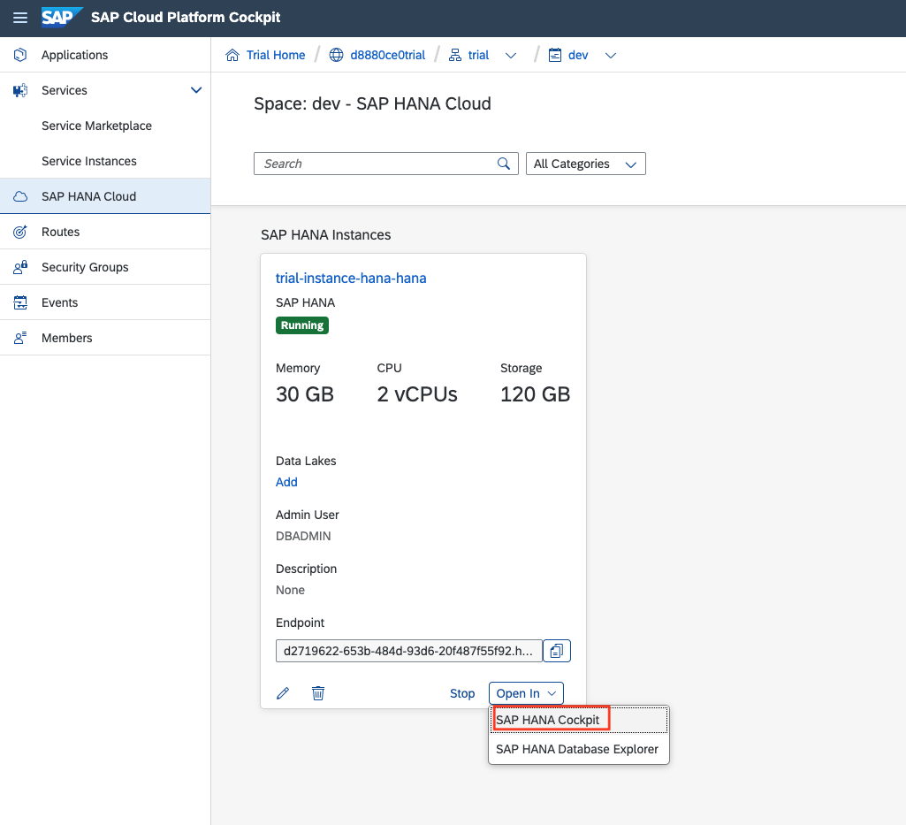

在SAP HANA Cockpit中, 选择 "Security and User Management" 视图.
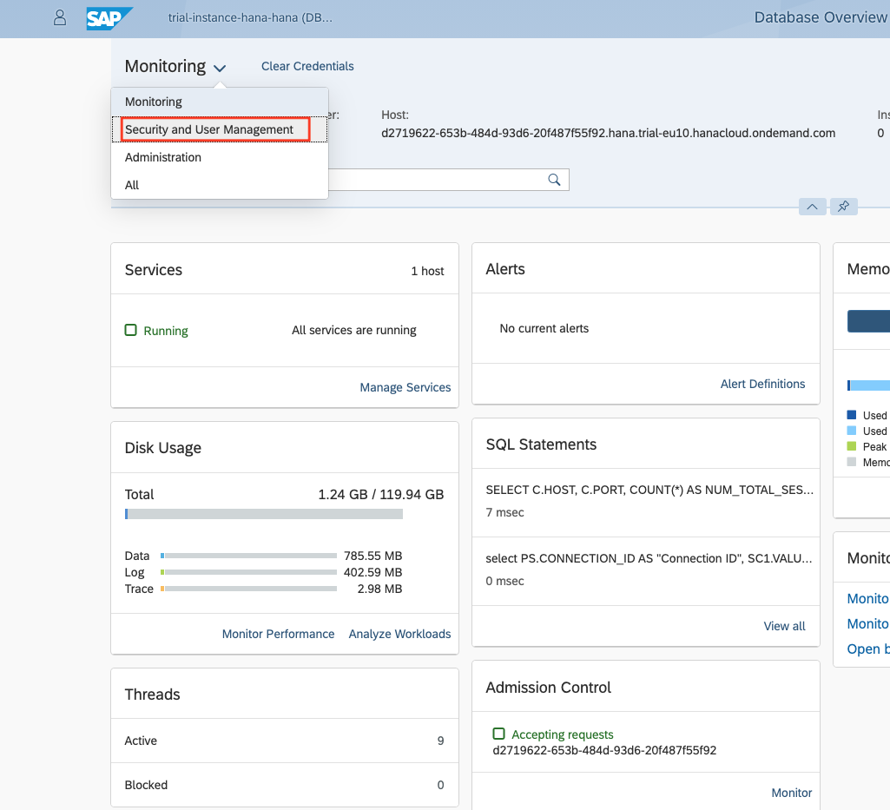

选择右侧的"User Management"选项.
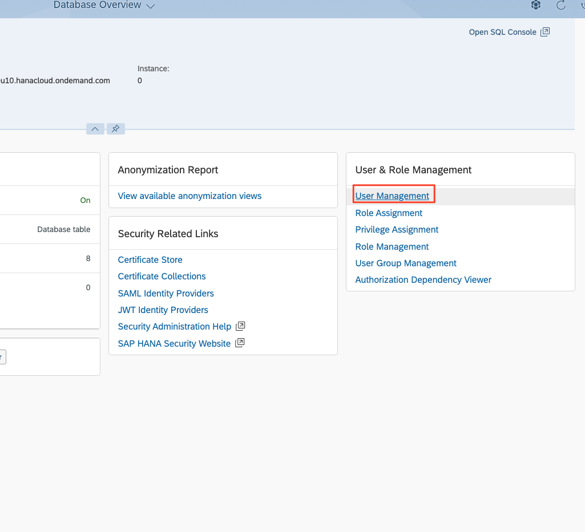

点击"+"按钮以创建新用户.

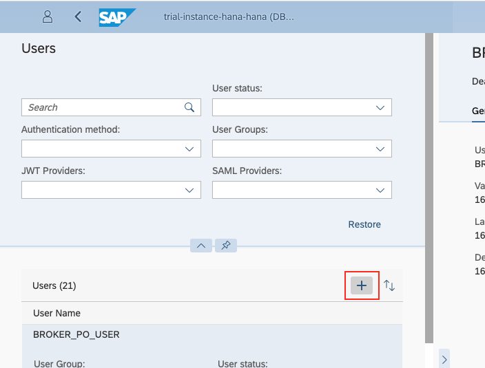

提供用户名并选择密码选项。 请记住密码。
以后将使用该用户连接到SAP HANA Cloud。
选择右下角的“保存”。
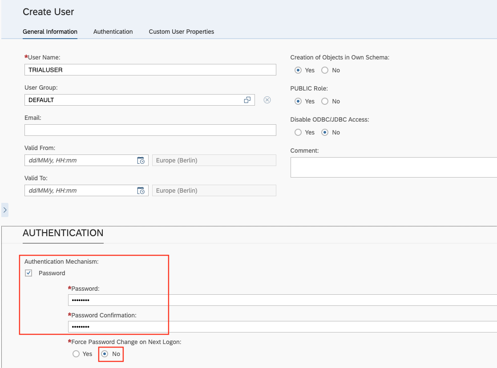

返回首页并选择"Privilege Assignment"将所需的权限分配给新创建的用户。
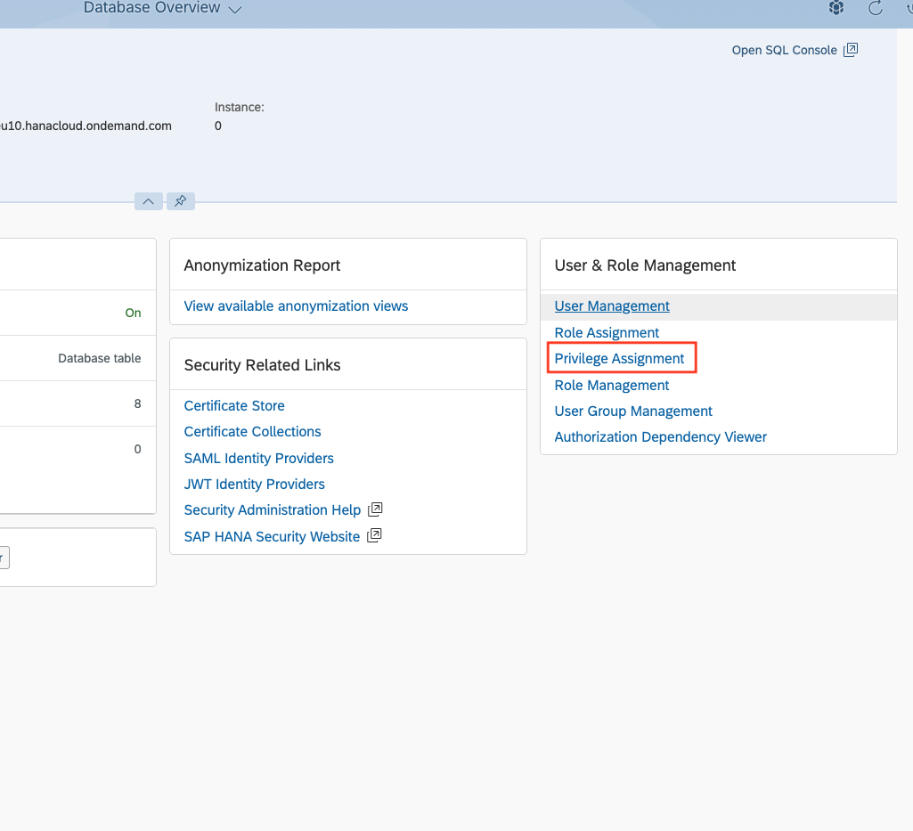

选择您新创建的用户并分配权限"CREATE SCHEMA" 和 "IMPORT"到这个用户。
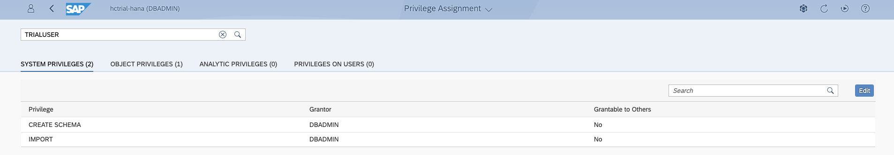

很棒！ 您已将SAP HANA Cloud实例配置为可以开始练习。
现在，返回SAP Cloud Platform并通过“打开方式”打开SAP HANA Database Explorer

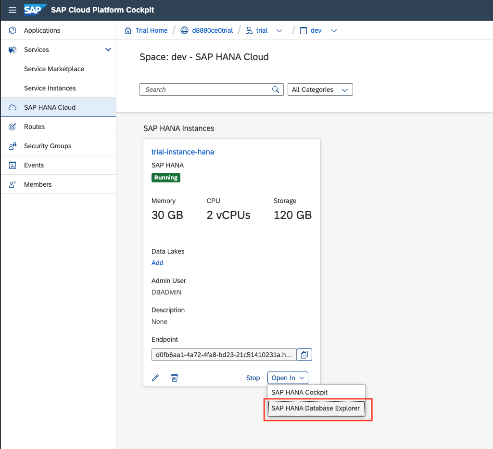

**请记住使用新创建的用户登录信息.
现在，您准备好进行练习了！ 玩得开心！**

## 基本数据和演示场景 <a name="subex2"></a>
练习的数据打包为HANA数据库导出。 这个 [export file](../data/DAT260.tar.gz) 在data目录中. 请将文件下载到本地计算机。

下载导出文件后, 您可以使用Database Explorer连接到您的HANA Cloud系统. 右单击"Catalog" 并且选择 "import catalog objects" 以开始这个向导.

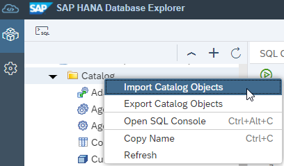

导入后, 您将发现在Schema`DAT260`下有5张表。 其中表`LONDON_POI`包含了9万个伦敦区域的兴趣点. 这包括酒吧和自行车维修店。 街道网络数据位于`LONDON_EDGES`和“`LONDON_VERTICES`中，`LONDON_EDGES`代表实际的150万条街道路段，`LONDON_VERTICES`描述80万个路口。 最后，有两个包含伦敦地铁系统数据的表-地铁站和连接。

这些数据是使用 [osmnx](https://github.com/gboeing/osmnx) python包下载的并且利用这个工具库 [Python Machine Learning Client for SAP HANA](https://pypi.org/project/hana-ml/) 导入到SAP HANA Cloud.

## 空间可视化 <a name="subex3"></a>
特别是在处理空间数据时，实际可视化结果非常有价值-理想情况下是在地图上。 没有适当的可视化，您将只会收到由纬度/经度对描述的几何形状，这很难解释。

根据安装软件的本地限制，可以考虑以下替代方法以可视化空间查询的结果。

作为示例，让我们尝试可视化一个简单的点。 我们可以通过在 ```DUMMY``` 表上执行空间函数 [```ST_GeomFromText```](https://help.sap.com/viewer/bc9e455fe75541b8a248b4c09b086cf5/2020_03_QRC/en-US/7a194a8e787c1014bed49b5134e6b930.html)的查询生成一个点。

```sql
SELECT ST_GeomFromText('POINT(8.642057 49.293432)', 4326) AS SHAPE FROM DUMMY;
```

### DBeaver.io - 具有内置空间可视化功能的开源数据库客户端
DBeaver是支持SAP HANA的开源数据库客户端. 可以从以下网站下载免费的社区版： [dbeaver.io](https://dbeaver.io/download/).

请参阅以下博客，了解如何建立与系统的连接.

[Good Things Come Together: DBeaver, SAP HANA Spatial & Beer](https://blogs.sap.com/2020/01/08/good-things-come-together-dbeaver-sap-hana-spatial-beer/)

上面的示例查询将返回与显示一个带有几何图形的地图预览的结果。
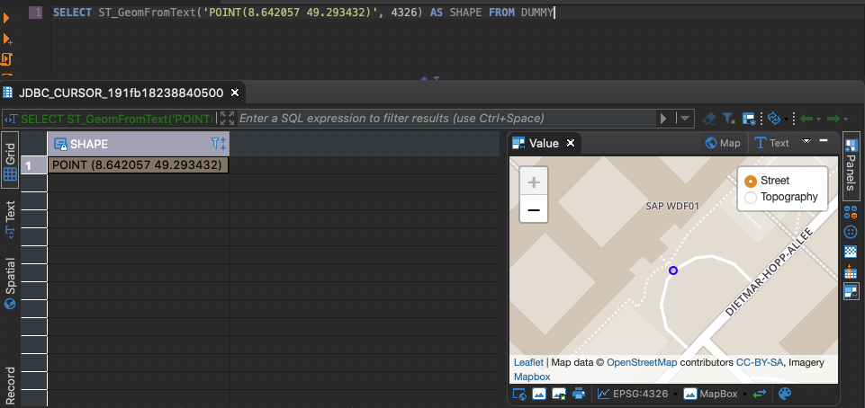

### GeoJson.io - 在线服务以可视化GeoJSON
如果安装本地软件有限制，则可以使用在线服务来显示几何图形。 一个例子是 [GeoJson.io](http://geojson.io). 这个服务可以可视化几何实体, 几何实体以 GeoJSON 并且带有 SRID（空间引用标识符） ```4326```. 你得使用函数 [```ST_Transform```](https://help.sap.com/viewer/bc9e455fe75541b8a248b4c09b086cf5/2020_03_QRC/en-US/e2b1e876847a47de86140071ba487881.html) 和函数 [```ST_AsGeoJson```](https://help.sap.com/viewer/bc9e455fe75541b8a248b4c09b086cf5/2020_03_QRC/en-US/7a157dd1787c1014a5d8d88e3811bcc8.html) 在SAP HANA上生成符合此要求的数据.

上面的示例查询变为
```sql
SELECT SHAPE.ST_Transform(4326).ST_AsGeoJson()
FROM 
(
  -- example query
  SELECT ST_GeomFromText('POINT(8.642057 49.293432)', 4326) AS SHAPE FROM DUMMY
);
```

可以将生成的GeoJSON复制并粘贴到Web表单中:
```json
{"type": "Point", "coordinates": [8.642057, 49.293432]}
```

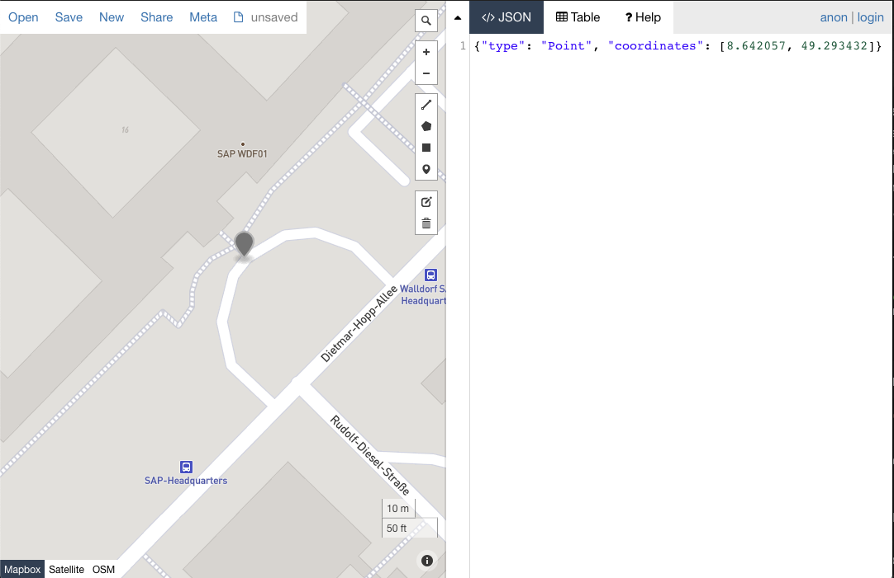

### [ST_AsSVGAggr](https://help.sap.com/viewer/bc9e455fe75541b8a248b4c09b086cf5/2020_03_QRC/en-US/b995aa41e2334478ba8351d6ecaa9467.html) - HANA函数生成可缩放的矢量图形（SVG,Scalable Vector Graphic） 
万一您的机器上甚至连互联网访问都受到限制（那么您甚至是如何阅读本练习的？），您可以使用HANA的内置功能生成可缩放的矢量图形，然后在浏览器中显示它。 使用这种方法，您将无需查看任何地图底图就可以简单地看到几何形状。

当然，这是探索数据最没有帮助的可视化。 尽管如此，将在下面给出一些有关如何执行此操作的详细信息 [练习 4.2 - 创建可缩放矢量图形（SVG）以可视化自行车道](exercises/ex4#subex2).

## 练习的结构 <a name="subex4"></a>
以下九个练习旨在让您深入了解SAP HANA Cloud的空间和图处理。 我们将为您提供示例数据，以试用SAP HANA Cloud，并体验多模型引擎的优势。
前五项练习着重于SAP HANA Spatial，而后四项练习着重于SAP HANA Graph。
我们建议从练习1开始，逐一进行练习。

## 背景资料 <a name="subex5"></a>

如果您对更多信息感兴趣或寻求更多指导或演示，请查看以下资源：

[SAP HANA Spatial Reference Guide](https://help.sap.com/viewer/bc9e455fe75541b8a248b4c09b086cf5/)

[SAP HANA Graph Reference Guide](https://help.sap.com/viewer/11afa2e60a5f4192a381df30f94863f9)

[SAP HANA Multi-model @ Devtoberfest](https://www.youtube.com/playlist?list=PL6RpkC85SLQA8za7iX9FRzewU7Vs022dl)

## 总结
现在，您应该掌握技术先决条件的概述以及掌握DAT260练习的必要背景信息！ 在开始练习时，请记住数据位于模式```DAT260```中。 确保通过执行以下命令将上下文设置为此模式：

```sql
SET SCHEMA DAT260;
```


继续 - [练习 1 - 根据WGS84参考系添加平面几何实体](../ex1/README.md)
