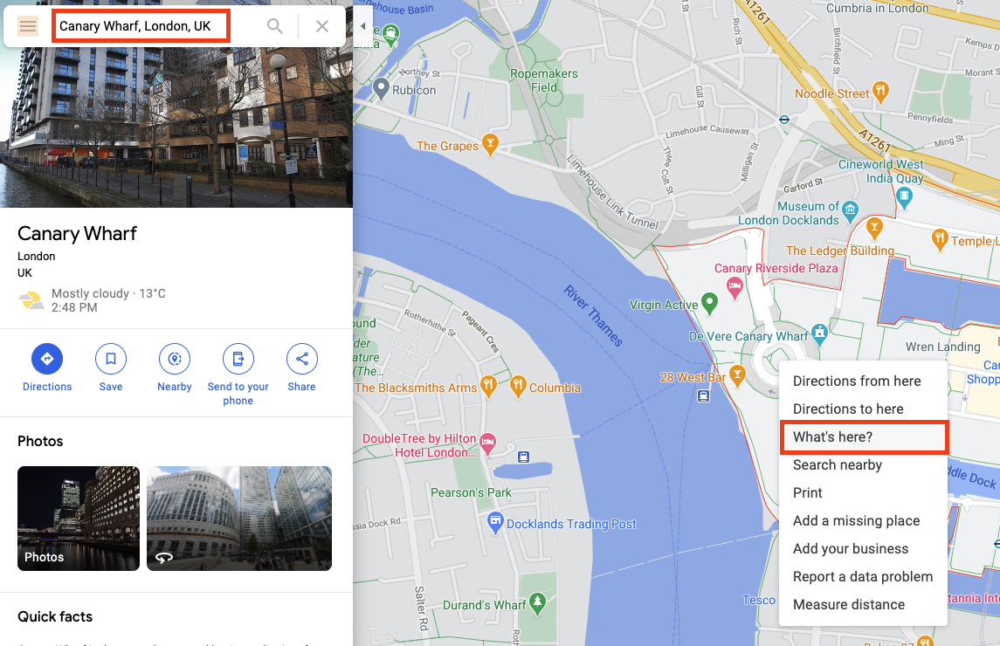
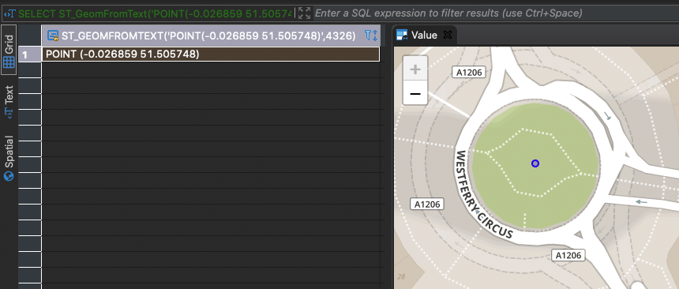
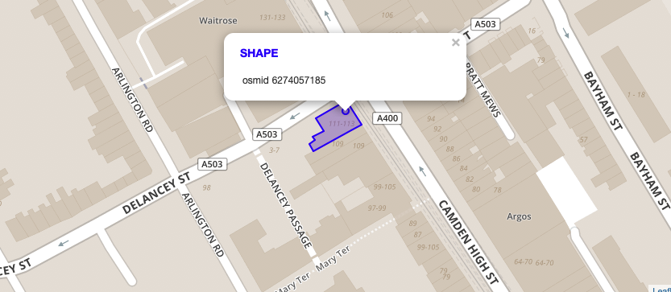

# 练习 2 - 计算到目标兴趣点(POI)的距离

假设你已经完成了今天的所有工作，走出办公室，想去伦敦的一家酒吧享受一份自制冰茶来犒劳自己。

在这个练习中，你需要计算你所在的位置和表`LONDON_POI`中的POI `bar`之间的距离。

## 练习 2.1 - 通过SQL语句选择一个位置
---
**你将在伦敦的Canary Wharf开始旅程。写一个select语句反映当前位置并标记为类型`ST_Geometry`**

---

首先，你需要确定你所在位置的经纬度。像Google Maps之类的在线地图服务在此可以帮你获取信息。访问[maps.google.com](https://www.google.com/maps)并放大找到伦敦的Canary Wharf。右键获取菜单并选择 `What's here?`。



你可以从窗口底部的小覆盖层中检索坐标，也可以从当前网页上复制粘贴。


我们可以使用函数[`ST_GeomFromText`](https://help.sap.com/viewer/bc9e455fe75541b8a248b4c09b086cf5/2020_03_QRC/en-US/7a194a8e787c1014bed49b5134e6b930.html)将这些坐标输入SAP HANA的SQL控制台中。这个几何构造器需要[Well-known Text (WKT)](https://en.wikipedia.org/wiki/Well-known_text_representation_of_geometry) 和相关的空间参考系统作为输入。经纬度的组合就是预期的WKT字符串。在这个练习中，相关的空间参考系统的id是4326 (WGS84)。

```sql
SELECT ST_GeomFromText('POINT(-0.026859 51.505748)', 4326) FROM DUMMY;
```

如果你用一个带有空间可视化插件的SQL编辑器，如[DBeaver](https://dbeaver.io/)，你可以预览位置并再次检查它是否与你之前选择的位置匹配。


为了使下面的练习更方便，最好将该点转换为与OSM数据相同的空间参考系统（SRS id 32630）。我们可以通过使用函数[`ST_AsWKT`](https://help.sap.com/viewer/bc9e455fe75541b8a248b4c09b086cf5/2020_03_QRC/en-US/7a169dff787c1014a095b86992806f14.html)来提取文本表示。

```sql
SELECT ST_GeomFromText('POINT(-0.026859 51.505748)', 4326)
    .ST_Transform(32630)
    .ST_AsWKT()
FROM DUMMY;
```

Result:
```
POINT (706327.107445 5710259.94449)
```

现在，我们可以通过调用下面的语句来选择空间参考系统32630中的点。

```sql
SELECT ST_GeomFromText('POINT (706327.107445 5710259.94449)', 32630) FROM DUMMY;
```

## 练习 2.2 - 选择目标兴趣点POI
---
**你想在Camden的 _Blues Kitchen_ 酒吧结束你的旅行。从表`LONDON_POI`中选择相应的条目。**

---

所有目标兴趣点都存储在表`LONDON_POI`中。我们可以根据`name`和`amenity`查找POI。后者描述POI的类型。在这个练习中，我们需要用值`bar`来查找。

```sql
SELECT * 
FROM LONDON_POI lp 
WHERE LOWER("name") LIKE '%blues kitchen%' AND "amenity" = 'bar'
```

你应该能在结果集中获得4条记录。如果你没有安装可视化工具，你可以用在线工具，如[Wicket](https://arthur-e.github.io/Wicket/sandbox-gmaps3.html)。Wicket能在空间参考系统4326中以WKT格式可视化几何图形。我们可以使用[ST_Transform](https://help.sap.com/viewer/bc9e455fe75541b8a248b4c09b086cf5/2020_03_QRC/en-US/e2b1e876847a47de86140071ba487881.html)和 [ST_AsWKT](https://help.sap.com/viewer/bc9e455fe75541b8a248b4c09b086cf5/2020_03_QRC/en-US/7a169dff787c1014a095b86992806f14.html)来从HANA中获取这些几何图形。

```sql
SELECT "osmid", SHAPE.ST_Transform(4326).ST_AsWKT() 
FROM LONDON_POI lp 
WHERE LOWER("name") LIKE '%blues kitchen%' AND "amenity" = 'bar';
```

当你把WKT格式的几何图形复制到你的在线可视化工具后,你会发现两个记录并不位于Camden，并且另外两个记录实际上是指相同的位置 - 其中一个是一个多边形描述建筑物的轮廓,另一个描述的是建筑物的位置。



接下来我们将使用带OSM ID（`osmid`字段）的POI **6274057185**。

```sql
SELECT * FROM LONDON_POI lp WHERE "osmid" = 6274057185;
```


## 练习2.3 - 用ST_Distance计算距离
---
**计算你所在位置与选定POI之间的直线距离。**

---

我们已经知道如何选择我们的位置（我们旅程的起点）和目标POI。我们需要用函数 [ST_Distance](https://help.sap.com/viewer/bc9e455fe75541b8a248b4c09b086cf5/2020_03_QRC/en-US/7a182aa3787c101481f996e3d419c720.html) 来计算两点之间的直线距离。

```sql
SELECT SHAPE.ST_Distance(
        ST_GeomFromText('POINT (706327.107445 5710259.94449)', 32630)
    ) 
FROM LONDON_POI lp 
WHERE "osmid" = 6274057185;
```

运行上述命令，我们可以得出结论：到自制冰茶的直线距离大约是8670米。

## 总结

你成功用WKT字符串创建了一个几何图形。另外，你使用DBeaver或如Wicket的在线可视化工具可视化了目标兴趣点。你使用空间函数 ST_Distance 计算了两点之间的直线距离。

继续进入 - [练习 3 - 确定交通网络的相关区域](../ex3/README.md)
