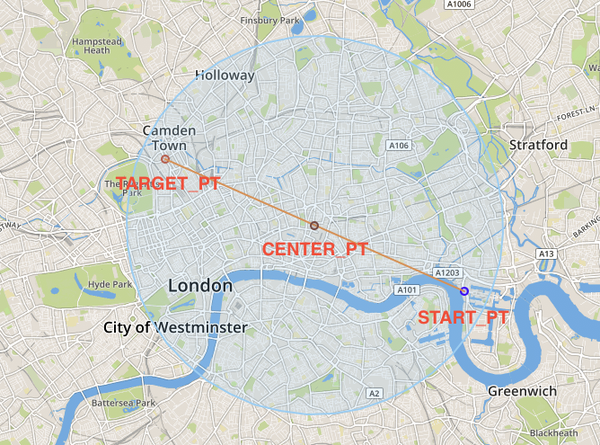
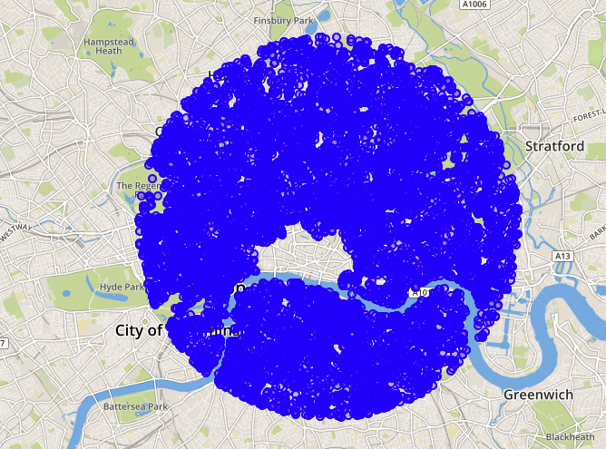

# 练习 3 - 确定交通网络的相关区域

现在，我们已经得到了从所在位置到目标位置的直线距离，我们要确定从开始到目标位置的相关区域。与其考虑整个交通网络来寻找路径，不如选择一个有意义的子网络。

## 练习 3.1 - 为相关区域创建圆区域
---
**构建一个圆来识别交通网络的相关区域。这个圆应该有一个最小的大小，并且应该包含起点和终点，在它周围有一个500米的缓冲区。**

---

接着，我们将使用子查询逐步进行查询，以便更好地理解SQL语句的处理方法和结果。

注意，包含两点的最小圆的中心点，是它们连线的中心点。

我们从前面的练习中看到如下两个点。

```sql
SELECT 
	ST_GeomFromText('POINT (706327.107445 5710259.94449)', 32630) AS START_PT,
	SHAPE AS TARGET_PT
FROM LONDON_POI lp 
WHERE "osmid" = 6274057185;
```

我们可以使用函数 [`ST_MakeLine`](https://help.sap.com/viewer/bc9e455fe75541b8a248b4c09b086cf5/2020_03_QRC/en-US/57758b2af95346db9a478a53ec2c4ccb.html)来构建连接两点的线。

```sql
SELECT ST_MakeLine(START_PT, TARGET_PT) AS CONN_LINE
FROM 
(
	-- previous statement
);
```
为了检索这条线上的任意一点，我们需要用函数[`ST_LineInterpolatePoint`](https://help.sap.com/viewer/bc9e455fe75541b8a248b4c09b086cf5/2020_03_QRC/en-US/c8efe60825514403865090fdf1dc1550.html)，它将直线的一部分作为参数。为了检索该线的中心点，我们传递值0.5。

```sql
SELECT CONN_LINE.ST_LineInterpolatePoint(0.5) AS CENTER_PT
FROM 
(
	-- previous statement
);
```

最后一步，我们要在`CENTER_PT`周围画一个半径为`distance(start, target)/2 + 500`的圆。将半径作为输入的相应函数是 [`ST_Buffer`](https://help.sap.com/viewer/bc9e455fe75541b8a248b4c09b086cf5/2020_03_QRC/en-US/010c53e227a94966bb009d52d9ec47a2.html)。

```sql
SELECT CENTER_PT.ST_Buffer(4835) AS AREA
FROM
(
    -- previous statement
);
```

上述步骤可以使用链式编程整合为一条简单的select语句。

```sql
SELECT 
    ST_MakeLine( 
        ST_GeomFromText('POINT (706327.107445 5710259.94449)', 32630),
        SHAPE
    )
    .ST_LineInterpolatePoint(0.5)
    .ST_Buffer(5000) AS AREA
FROM LONDON_POI
WHERE "osmid" = 6274057185;
```

下图展示了我们是如何通过构建圆来选择相关的交通子网络的。



## 练习 3.2 - 为圆内所有节点添加标识
---
**通过设置 `in_scope = true`来标识交通网络中的所有节点**

---

首先，我们需要根据列`in_scope`来增强现有的顶点表。

```sql
ALTER TABLE LONDON_VERTICES ADD (IN_SCOPE INTEGER);
```

然后，我们根据区域的交集，用`0`或`1`填充该列。我们可以用函数[`ST_Intersects`](https://help.sap.com/viewer/bc9e455fe75541b8a248b4c09b086cf5/2020_03_QRC/en-US/7a19e197787c1014a13087ee8f970cce.html)来判断两个图形是否相交。

我们将使用[`MERGE INTO`](https://help.sap.com/viewer/c1d3f60099654ecfb3fe36ac93c121bb/2020_03_QRC/en-US/3226201f95764a57810dd256c9524d56.html)，代替[`UPDATE`](https://help.sap.com/viewer/c1d3f60099654ecfb3fe36ac93c121bb/2020_03_QRC/en-US/20ff268675191014964add3d17700909.html) ，因为它可以实现更复杂的更新逻辑。

```sql
MERGE INTO LONDON_VERTICES lv
USING 
(
	-- previous statement begin --
	SELECT 
    	ST_MakeLine( 
        	ST_GeomFromText('POINT (706327.107445 5710259.94449)', 32630),
        	SHAPE
    	)
    	.ST_LineInterpolatePoint(0.5)
    	.ST_Buffer(5000) AS AREA
	FROM LONDON_POI
	WHERE "osmid" = 6274057185
    	-- previous statement end --
) circle ON 1=1
WHEN MATCHED THEN UPDATE SET lv.IN_SCOPE = CIRCLE.AREA.ST_Intersects(SHAPE);

```

我们可以通过可视化以下查询的结果集来确认我们选择了正确的节点。

```sql
SELECT SHAPE FROM LONDON_VERTICES WHERE IN_SCOPE = 1;
```



## 总结

你已经确定了一个交通子网络。在下面的练习，你将考虑如何用它来找出你在伦敦的出行路径。

继续进入 - [练习4 - 查看这个地区是否适合骑自行车](../ex4/README.md)
