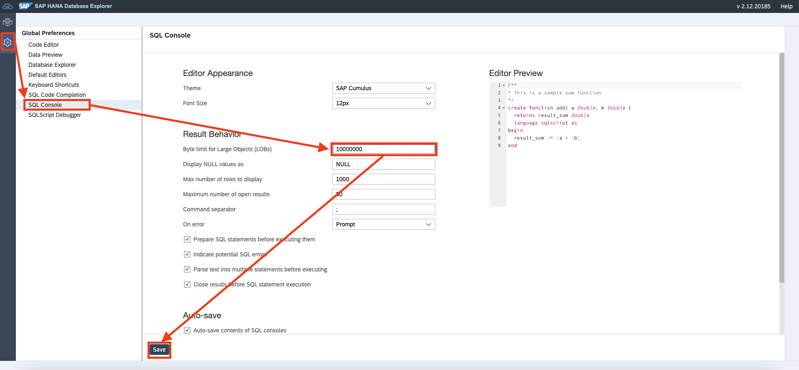
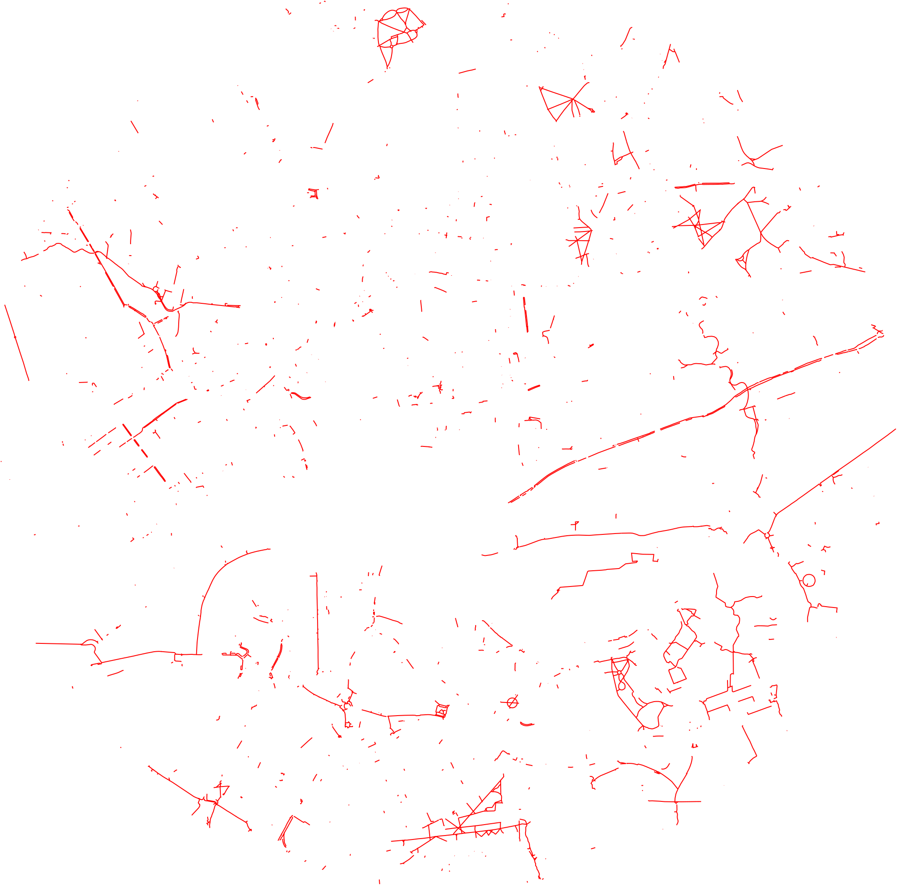
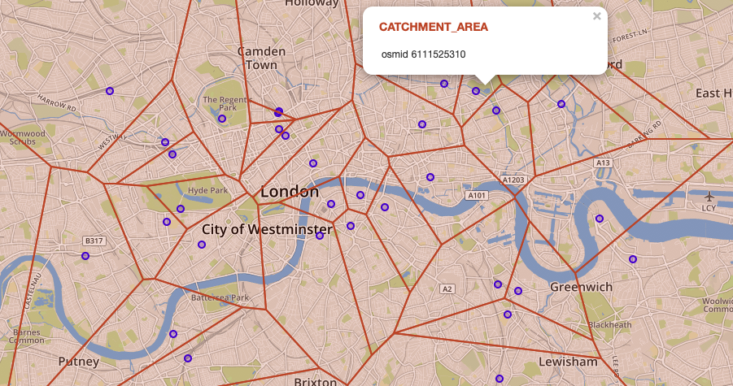

# 练习 4 - 查看这个地区是否适合骑自行车

现在，我们已经确定了旅行的目标以及相关的交通区域，我们需要确定这个地区是否适合骑自行车旅行。补充一下：一辆自行车，这是我们去酒吧的交通工具。

## 练习 4.1 - 确定骑行路线
---
**选择之前确定的区域内带有属性 `highway = 'cycleway'`的边**

---

除了筛选条件`highway = 'cycleway'`，我们还需要确定有关联的两个顶点是否都在我们确定的区域之内。如果只有一个顶点在区域范围内，这将意味着我们通过这条边时需要离开确定的区域。

```sql
SELECT le.* 
FROM LONDON_EDGES le 
JOIN LONDON_VERTICES u ON le.SOURCE = u."osmid" 
JOIN LONDON_VERTICES v ON le.TARGET = v."osmid" 
WHERE u.IN_SCOPE = 1 AND v.IN_SCOPE = 1 AND le."highway" = 'cycleway'
```

## 练习 4.2 - 创建可缩放矢量图形（SVG）以可视化自行车道
---
**汇总上面找到的自行车道，并创建矢量图形（SVG）以显示London的自行车道的构成。**

---

为了执行空间并运算并从上述查询的结果集中构造一个图形，我们使用[`ST_UnionAggr`](https://help.sap.com/viewer/bc9e455fe75541b8a248b4c09b086cf5/2020_03_QRC/en-US/601aa9fb93e241af96faafcb8f01b12e.html)。

SAP HANA的几何图形输出格式之一是可伸缩向量图形[Scalable Vector Graphic（SVG）](https://en.wikipedia.org/wiki/Scalable_Vector_Graphics)。用于生成几何图形的SVG表示的函数是[`ST_AsSVG`](https://help.sap.com/viewer/bc9e455fe75541b8a248b4c09b086cf5/2020_03_QRC/en-US/ef447b3e0a964cd5bbe82074f4225f84.html)。我们可以通过可选参数来定制SVG样式。

> **提示**<br>
> 要在DB Explorer中查看（并复制）完整的SVG输出，你需要增加“大文件（LOB）的字节数限制”。 你可以将值设置为“0”，它将自动转换为最大可能值。
> 

以下查询将SVG创建为CLOB：
```sql
SELECT ST_UnionAggr(le.SHAPE).ST_AsSVG(Attribute=>'stroke="red" stroke-width="0.1%"')
FROM LONDON_EDGES le 
JOIN LONDON_VERTICES u ON le.SOURCE = u."osmid" 
JOIN LONDON_VERTICES v ON le.TARGET = v."osmid" 
WHERE u.IN_SCOPE = 1 AND v.IN_SCOPE = 1 AND le."highway" = 'cycleway';
```

要查看SVG，只需将输出复制并粘贴到文件中，并给其命名以'.svg'结尾。 您可以通过浏览器来查看SVG文件。

原始SVG：


## 练习 4.3 - 使用Voronoi确定自行车维修站的覆盖范围
---
**选择所有自行车维修站，并使用Voronoi图（冯洛诺伊图，即泰森多边形）确定其服务区域。**

---

查找自行车维修站很容易，因为`amenity`字段携带了此类POI的`bicycle_repair_station`值。

```sql
SELECT *
FROM LONDON_POI
WHERE "amenity" = 'bicycle_repair_station';
```

POI的[Voronoi cell](https://en.wikipedia.org/wiki/Voronoi_diagram)（也称为Thiessen多边形）区域满足：区域中任意一点到此POI的距离都比到列表中其他POI近。 空间窗口函数[`ST_VoronoiCell`](https://help.sap.com/viewer/bc9e455fe75541b8a248b4c09b086cf5/2020_03_QRC/zh-CN/901a780341dc41c5b4c2e8c58975d2af.html)可让您在数据库中创建Voronoi cell。

```sql
SELECT
	"osmid" ,
    SHAPE,
	ST_VoronoiCell(SHAPE, 10.0) OVER () AS CATCHMENT_AREA
FROM LONDON_POI 
WHERE "amenity" LIKE 'bicycle_repair_station';
```

Voronoi cell可用于确定城市中到特定位置最近的自行车维修站。



## 总结

你已经了解了交通网络是否适合骑自行车。因此，您已经可视化了自行车道以及自行车维修站的覆盖范围。

继续进入 - [练习 5 - 将POI对应到街道网络的节点上](../ex5/README.md)
