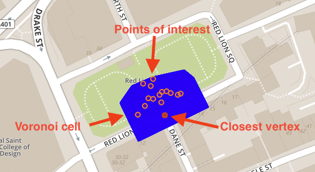

# 练习5-将POI捕捉到街道网络的节点

在我们的数据集中，我们有兴趣点（表 `LONDON_POI`）以及运输网络的节点（表 `LONDON_VERTICES`）。 当然，两者之间存在空间关系（例如，通过 `ST_Distance` 测量的距离）。 在本练习中，我们希望将每个POI分配给交通网络中离它最接近的节点。 您可以考虑将 `bar` 分配到最近的街角。


这样，我们以后就可以计算出兴趣点之间的最短路径。

## 练习5.1-持久化所有节点的Voronoi Cells

---
**通过列 `VORONOI_CELL` 增强表 `LONDON_VERTICES`，该列将各个顶点/节点的Voronoi cell（沃罗诺伊图，即泰森多边形）保留为 `ST_Geometry`**

---

首先，我们需要增强现有表。

```sql
ALTER TABLE LONDON_VERTICES ADD (VORONOI_CELL ST_Geometry(32630));
```

其次，我们使用 [MERGE INTO](https://help.sap.com/viewer/c1d3f60099654ecfb3fe36ac93c121bb/2020_03_QRC/en-US/3226201f95764a57810dd256c9524d56.html) 来更新值并将其分配给各自的Voronoi cell。

```sql
MERGE INTO LONDON_VERTICES
USING
(
	SELECT "osmid", ST_VoronoiCell(shape, 10.0) OVER () AS CELL
	FROM LONDON_VERTICES
) v ON LONDON_VERTICES."osmid" = v."osmid"
WHEN MATCHED THEN UPDATE SET LONDON_VERTICES.VORONOI_CELL = v.CELL;
```

## 练习5.2-持久化每个兴趣点的质心

---
**通过列 `SHAPE_CENTROID` 来增强表 `LONDON_POI`，该列包含各个兴趣点的质心。 请注意，许多POI实际上是多边形。**

---

我们需要使用空间参考系统 `32630` 通过另一种几何形状将表 `LONDON_POI` 增强。

```sql
ALTER TABLE LONDON_POI ADD (SHAPE_CENTROID ST_GEOMETRY(32630));
```

由于OpenStreetMap数据中的POI可以包含点和多边形（例如存储房屋的形状），因此表 `LONDON_POI` 中的 `SHAPE` 列包含点和多边形的混合。 我们想要将这些点复制到 `SHAPE_CENTROID` 列，并且-如果是多边形，会计算其质心，然后将所得的点分配给 `SHAPE_CENTROID` 列。

我们将使用函数[`ST_GeometryType`](https://help.sap.com/viewer/bc9e455fe75541b8a248b4c09b086cf5/2020_03_QRC/en-US/7a190326787c10148831cde7ab32410d.html)来确定记录是否包含点或多边形，并使用函数[`ST_Centroid`](https://help.sap.com/viewer/bc9e455fe75541b8a248b4c09b086cf5/2020_03_QRC/en-US/7a2b9111787c1014926c93c8506930b1.html)来计算后者的质心。

```sql
UPDATE LONDON_POI 
SET SHAPE_CENTROID = 
    CASE 
        WHEN SHAPE.ST_GeometryType() = 'ST_Point' 
        THEN SHAPE 
        ELSE SHAPE.ST_Centroid() 
    END;
```

## 练习5.3-使用节点参考增强POI表

---
**将每个POI与其在运输网络中最近的顶点相连。 为此，用列 `VERTEX_OSMID` 增强表 `LONDON_POI` 并填充最接近顶点的 `osmid`。**

---

为了对表进行物理增强，我们需要考虑表 `LONDON_VERTICES` 中引用的 `osmid` 是 `BIGINT` 类型。

```sql
ALTER TABLE LONDON_POI ADD (VERTEX_OSMID BIGINT);
```

在之前的练习中，我们了解了Voronoi cell的定义和用法。 我们将使用已经存在的Voronoi cell来确定每个POI的最接近顶点。 请注意，如果POI在特定顶点的Voronoi cell内，则意味着该顶点比其他任何顶点更接近POI。

有了这些知识，我们就可以使用空间函数[`ST_Intersects`](https://help.sap.com/viewer/bc9e455fe75541b8a248b4c09b086cf5/2020_03_QRC/en-US/7a19e197787c1014a13087ee8f970cce.html)为数据集中的每个POI分配一个顶点。

```sql
MERGE INTO LONDON_POI lp
USING LONDON_VERTICES lv
ON lv.VORONOI_CELL.ST_Intersects(lp.SHAPE_CENTROID) = 1
WHEN MATCHED THEN UPDATE SET lp.VERTEX_OSMID = lv."osmid"; 
```

此图说明了捕捉逻辑。



## 总结

现在，您已经将每个感兴趣的点连接到了运输网络中的一个节点/顶点。 这将使您在以下练习中能够计算出POI之间的最短路径。

继续到-[练习6-为图引擎准备数据并创建图工作区](../ex6/README.md)
