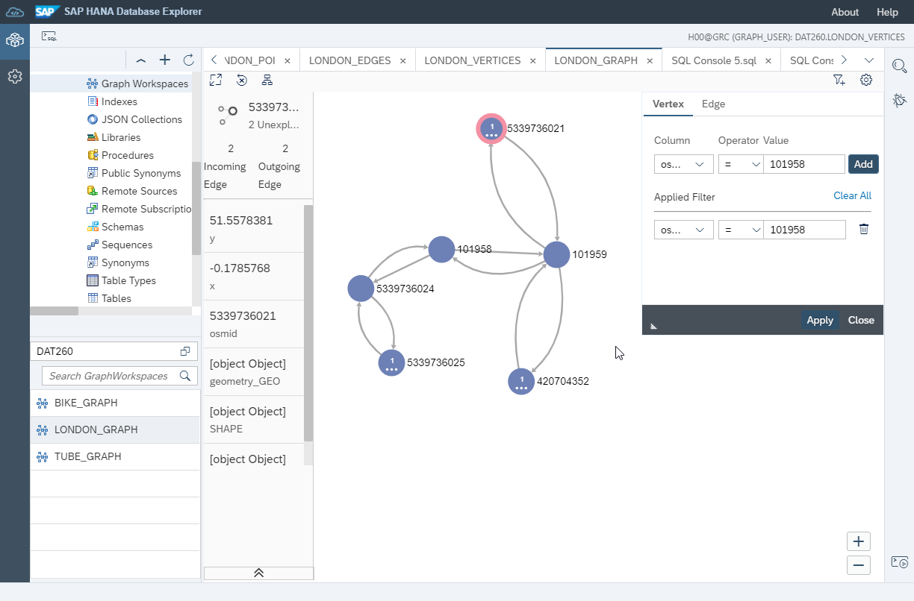

# 练习 6 - 为图引擎准备数据并创建图工作区

我们的图数据集描述了伦敦的街道网络。 从形式上来说, 一个图是由节点和边组成。 在我们的例子中, 我们将街道存储在 `LONDON_EDGES` 表中, 将链接街道的路口存储在`LONDON_VERTICES` 表中。 图中的边是有方向的，他们有起点和终点。 现实世界中的街道大部分是双向都可以通行的， 所以在我们的图中，大多数的街道都由两条边来表示——每一条边表示一个方向。

SAP HANA graph引擎要求这两个表都有主键, 并且一条边的起点和终点不能包含NULL值。 为了确保图的一致性，在 SOURCE 和 TARGET这两列上建立外键也是一个好习惯。 这样做可以防止产生“悬空的边”，即没有顶点的边。准备好数据后，即可通过GRAPH WORKSPACE将其公开给SAP HANA Graph图引擎。

## 练习 6.1 在表上定义所需的约束 <a name="subex1"></a>
---
**在 LONDON_EDGES 和 LONDON_VERTICES 表上建立主键, 并且在SOURCE 和 TARGET 列上建立外键。**

---

```sql
ALTER TABLE "LONDON_EDGES" ADD PRIMARY KEY("ID");
ALTER TABLE "LONDON_VERTICES" ADD PRIMARY KEY("osmid");

ALTER TABLE "LONDON_EDGES" ALTER("SOURCE" BIGINT NOT NULL REFERENCES "LONDON_VERTICES" ("osmid") ON UPDATE CASCADE ON DELETE CASCADE);
ALTER TABLE "LONDON_EDGES" ALTER("TARGET" BIGINT NOT NULL REFERENCES "LONDON_VERTICES" ("osmid") ON UPDATE CASCADE ON DELETE CASCADE);
```

## 练习 6.2 创建一个 Graph Workspace <a name="subex2"></a>
---
**在 LONDON_EDGES 和 LONDON_VERTICES 表上创建一个 `GRAPH WORKSPACE`**

---
 Graph Workspace 将你的数据暴露给 SAP HANA graph 引擎。这可以理解为一种用于查看您数据的“视图”。 在我们的例子中，Graph Workspace是直接在表上定义的。 请注意，您还可以将SQL视图，表函数和远程表用作数据源。 您可以在一个系统中定义多个graph workspace。
```sql
CREATE GRAPH WORKSPACE "LONDON_GRAPH"
	EDGE TABLE "LONDON_EDGES"
		SOURCE COLUMN "SOURCE"
		TARGET COLUMN "TARGET"
		KEY COLUMN "ID"
	VERTEX TABLE "LONDON_VERTICES"
		KEY COLUMN "osmid";
```

要想查看您创建的图网络的全貌，您可以右键单击LONDON_GRAPH workspace以启动图查看器。



## 总结

我们已经在我们的 `LONDON_VERTICES` 和 `LONDON_EDGES` 表上定义了约束， 并且创建了一个 `GRAPH WORKSPACE`. 我们已经做好了准备来运行一些图论相关的东西。

继续到 - [练习 7 - 使用图存储过程计算街道网络上的最短路径 ](../ex7/README.md)
