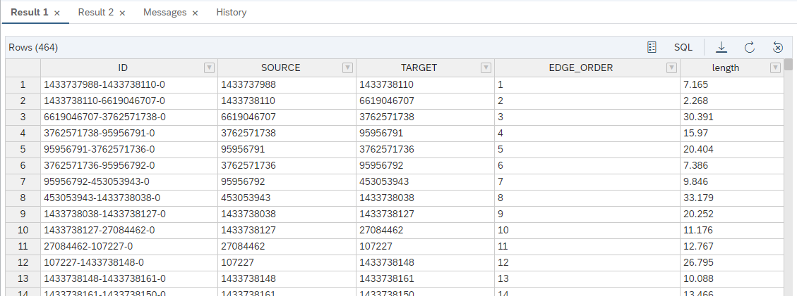

# 练习7-使用图储存过程计算街道网络上的最短路径

一旦定义了 `GRAPH WORKSPACE`，就可以运行[openCypher](https://www.opencypher.org/) for [pattern matching](https://help.sap.com/viewer/11afa2e60a5f4192a381df30f94863f9/2020_03_QRC/en-US/4c3ee700e7a8458baed3f1141d9380f3.html)查询以进行模式匹配工作，或者创建图程序进行网络分析。 在本练习中，我们将创建一个数据库储存过程，该储存过程使用内置函数来计算两个顶点之间的最短路径。

## 练习7.1 定义程序所需的表类型

---
**创建一个 `TABLE TYPE` 来描述该储存过程的输出表，包含ID，SOURCE，TARGET，EDGE_ORDER（BIGINT）和长度（DOUBLE）**

---

如果您使用SQLScript来熟悉SAP HANA数据库储存过程，那么您已经知道如何处理类似表的结果。 一种简洁的方法是定义和使用 `TABLE TYPES`。 对于图程序，相同的方法有效。 我们的表类型 `TT_SPOO_EDGES` 描述了路径结果的结构。 它包括边的ID和在边上遍历的ORDER。

```sql
CREATE TYPE "TT_SPOO_EDGES" AS TABLE (
    "ID" VARCHAR(5000), "SOURCE" BIGINT, "TARGET" BIGINT, "EDGE_ORDER" BIGINT, "length" DOUBLE)
;
```

## 练习7.2 创建用于最短路径计算的图储存过程

---
**使用内置的Shortest_Path函数创建图存储过程。**

---

下面的存储过程类看上去类似于SQLScript存储过程-头部描述输入和输出变量，接下来是实际代码。 下面的代码是一种特定于图形的编程语言，称为GRAPH。 GRAPH存储过程不使用关系对象和表，SQL之类的操作，而是对顶点和边进行操作。 该过程的核心是内置图形算法的调用：

`WeightedPath <BIGINT> p =最短路径（：g，：v_start，：v_end，：i_direction）;`

其中，`g` 是我们的图形, `v_start` 和 `v_end` 是我们正在搜索的路径的开始/结束顶点，而 `i_direction` 则表示可以遍历边的方向（OUTGOING，INCOMING或 ANY）。 结果分配给路径对象 `p`。

```sql
CREATE OR REPLACE PROCEDURE "GS_SPOO"(
	IN i_startVertex BIGINT,       -- INPUT: the ID of the start vertex
	IN i_endVertex BIGINT,         -- INPUT: the ID of the end vertex
	IN i_direction NVARCHAR(10),   -- INPUT: the direction of the edge traversal: OUTGOING (default), INCOMING, ANY
	OUT o_path_length BIGINT,      -- OUTPUT: the hop distance between start and end
	OUT o_edges "TT_SPOO_EDGES" -- OUTPUT: a table containing the edges that make up a shortest path between start and end
	)
LANGUAGE GRAPH READS SQL DATA AS BEGIN
	-- Create an instance of the graph, referring to the graph workspace object
	GRAPH g_all = Graph("DAT260", "LONDON_GRAPH");
  -- Using the IN_SCOPE attribute created in "Exercise 3 Identify Relevant Area for Transportation Network" to narrow down the search scope
  GRAPH g = SubGraph(:g_all, v IN Vertices(:g_all) WHERE :v."IN_SCOPE" == 1);
	-- Create an instance of the start/end vertex
	VERTEX v_start = Vertex(:g, :i_startVertex);
	VERTEX v_end = Vertex(:g, :i_endVertex);
	-- Runnning shortest path one-to-one based hop distance, i.e. the minimum number of edges between start and end
	WeightedPath<BIGINT> p = Shortest_Path(:g, :v_start, :v_end, :i_direction);
	o_path_length = LENGTH(:p);
	o_edges = SELECT :e."ID", :e."SOURCE", :e."TARGET", :EDGE_ORDER, :e."length" FOREACH e IN Edges(:p) WITH ORDINALITY AS EDGE_ORDER;
END;
```

如果您还记得的话，我们使用了练习3中创建的 “IN_SCOPE" 属性来关注相关区域。 为此，我们通过过滤完整的LONDON_GRAPH g_all来“诱导”一个子图。

数据库存储过程与其他存储过程一样-使用提供输入参数的CALL语句。 因为我们已经将POI数据捕捉到街道网络中的节点（练习5），我们现在可以查找VERTEX_OSMID来获取我们的起点和终点的POI：Canary Wharf捕捉到1433737988，Blues Kitchen捕捉到1794145673。

```sql
-- Look up VERTEX_OSMID of POI Blues kitchen
SELECT VERTEX_OSMID FROM "LONDON_POI" WHERE "name" = 'Blues Kitchen' AND "osmid" = 6274057185;
CALL "GS_SPOO"(i_startVertex => 1433737988, i_endVertex => 1794145673, i_direction => 'ANY', o_path_length => ?, o_edges => ?);
-- or in short
CALL "GS_SPOO"(1433737988, 1794145673, 'ANY', ?, ?);
```

结果是构成路径的一组边/街段。 `EDGE_ORDER` 值标识序列。 该过程还返回 `O_PATH_LENGTH` = 464，这是从Canary Wharf到Blues Kitchen的最小跃点数。



## 练习7.3 匿名块-临时运行GRAPH代码

有时，动态生成和执行GRAPH代码而不在数据库中创建存储过程会更方便。 这种方法称为“匿名块”。 下面的代码与上面的过程基本相同，但是这次它是在DO-BEGIN-END块中执行。

```sql
DO (
    IN i_startVertex BIGINT => 14680080, IN i_endVertex BIGINT => 7251951621,
    OUT o_edges TABLE("ID" NVARCHAR(5000), "SOURCE" BIGINT, "TARGET" BIGINT, "EGDE_ORDER" BIGINT, "length" DOUBLE) => ?
) LANGUAGE GRAPH
BEGIN
                GRAPH g = Graph("LONDON_GRAPH");
                VERTEX v_start = Vertex(:g, :i_startVertex);
                VERTEX v_end = Vertex(:g, :i_endVertex);
                WeightedPath<BIGINT> p = Shortest_Path(:g, :v_start, :v_end, 'ANY');
                o_edges = SELECT :e."ID", :e."SOURCE", :e."TARGET", :EDGE_ORDER, :e."length" FOREACH e IN Edges(:p) WITH ORDINALITY AS EDGE_ORDER;
END;

```

## 总结

我们创建了一个GRAPH存储过程，它可以计算起点和终点之间的跳跃距离最短路径。

继续到-[练习8-使用更复杂的成本函数计算最短路径](../ex8/README.md)
