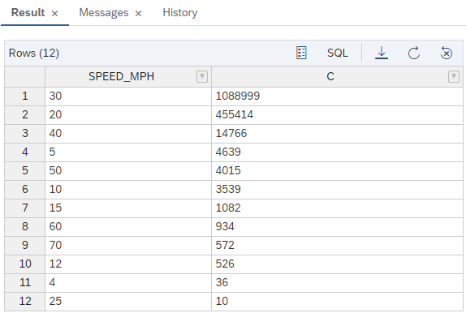
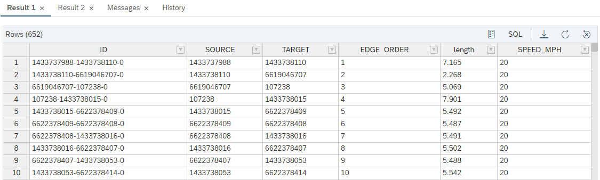
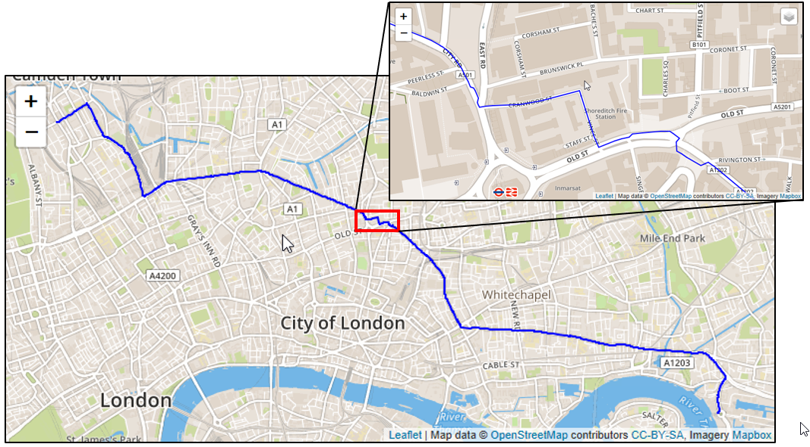
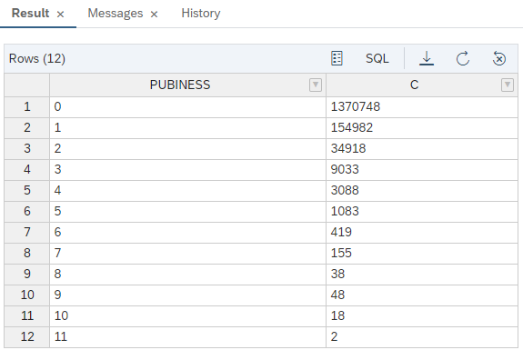
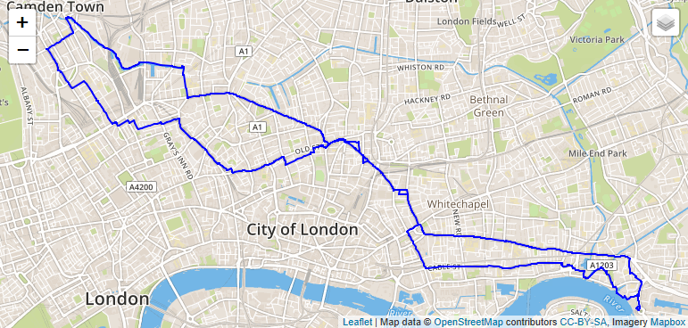

# 练习 8 - 使用一个更复杂的成本函数计算最短路径

在上一章的练习中我们使用hop distance来计算最短路径。现在我们用一个更有意义的成本函数- 我们推导出穿越街道段所需的时间。边表包含“length”和“maxspeed”列。“maxspeed” 是具有像‘30 mph’值的字符串类型的列。我们将创建一个新的数字类型的列“SPEED_MPH”，并将“maxspeed”的数字部分提取到该列中。然后，我们将重写我们的过程，以表达式“length”/“SPEED_MPH”作为成本函数。

## 联系 8.1 生成一个数字列，其中包含允许的最大速度信息 <a name="subex1"></a>

---
**向LONDON_BIKE_EDGES表添加一个整数列。提取“maxspeed”的数字部分。**

---

```sql
ALTER TABLE "LONDON_EDGES" ADD("SPEED_MPH" INT);
UPDATE "LONDON_EDGES"
	SET "SPEED_MPH" = TO_INT(REPLACE("maxspeed", ' mph', ''))
	WHERE REPLACE("maxspeed", ' mph', '') <> "maxspeed" ;
SELECT "SPEED_MPH", COUNT(*) AS C FROM "LONDON_EDGES" GROUP BY "SPEED_MPH" ORDER BY C DESC;
-- 让我们在没有速度信息的段上添加一个默认值
UPDATE "LONDON_EDGES" SET "SPEED_MPH" = 30 WHERE "SPEED_MPH" IS NULL;
```

这是使用默认值更新后的SPEED_MPH分布。



## 练习 8.2 计算最短路径，以最小化从头到尾花费的时间 <a name="subex2"></a>

与上一个示例一样，我们定义了表类型和存储过程。这一次，我们使用“length”/SPEED_MPH作为成本函数。 语法上，cost函数是一个lambda函数，如下所示:&nbsp;

`
(Edge e) => DOUBLE{ return :e."length"/DOUBLE(:e."SPEED_MPH"); }
`

```sql
CREATE TYPE "TT_SPOO_WEIGHTED_EDGES" AS TABLE (
    "ID" VARCHAR(5000), "SOURCE" BIGINT, "TARGET" BIGINT, "EDGE_ORDER" BIGINT, "length" DOUBLE, "SPEED_MPH" INT
);
```
```sql
CREATE OR REPLACE PROCEDURE "GS_SPOO_WEIGHTED"(
	IN i_startVertex BIGINT, 		-- 输入: 开始顶点的ID
	IN i_endVertex BIGINT, 			-- 输入: 结束顶点的ID
	IN i_direction NVARCHAR(10), 	-- 输入: 边缘遍历的方向: OUTGOING (默认), INCOMING, ANY
	OUT o_path_length BIGINT,		-- 输出: 开始和结束之间的跳跃距离
	OUT o_path_weight DOUBLE,		-- 输出: 路径的 weight/cost
	OUT o_edges "TT_SPOO_WEIGHTED_EDGES"  -- 输出: 构成路径的边缘
	)
LANGUAGE GRAPH READS SQL DATA AS BEGIN
	-- 创建图形的实例，该实例引用了图形工作区对象
	GRAPH g = Graph("DAT260", "LONDON_GRAPH");
	-- 创建一个开始/结束顶点的实例
	VERTEX v_start = Vertex(:g, :i_startVertex);
	VERTEX v_end = Vertex(:g, :i_endVertex);
	--WeightedPath<DOUBLE> p = Shortest_Path(:g, :v_start, :v_end, (Edge e) => DOUBLE{ return :e."length"; }, :i_direction);
	WeightedPath<DOUBLE> p = Shortest_Path(:g, :v_start, :v_end,
		(Edge e) => DOUBLE{
			return :e."length"/DOUBLE(:e."SPEED_MPH");
		}, :i_direction);
	o_path_length = LENGTH(:p);
	o_path_weight = WEIGHT(:p);
	o_edges = SELECT :e."ID", :e."SOURCE", :e."TARGET", :EDGE_ORDER, :e."length", :e."SPEED_MPH" FOREACH e IN Edges(:p) WITH ORDINALITY AS EDGE_ORDER;
END;
```

调用存储过程。

```sql
CALL "GS_SPOO_WEIGHTED"(1433737988, 1794145673, 'ANY', ?, ?, ?);
```



如果你把它放到地图上就如下所示：



## 练习 8.3 寻找酒吧和自行车道 <a name="subex3"></a>

找到最快的路线很容易。让我们找两条更有趣的路径。首先，我们要找到适合自行车的路径。我们可以通过增加街道的“自行车道”来实现这一点。 注意，在大多数情况下，你不能只走自行车道。路径算法将总是优先选择自行车道，除非自行车道比普通道路长10倍。基于此种逻辑，我们将在成本函数中使用“IF”语句。
其次，我们希望找到“有吸引力的”途径。我们将计算一种新的边缘测量——“PUBINESS”——这是由附近酒吧的数量得出的。

首先，让我们通过数100米以内的酒吧来计算酒吧数量，并将其添加到我们的“LONDON_EDGES”表格中。我们使用空间ST_WithinDistance方法作为连接条件:<br>
`ON pubs."SHAPE".ST_WithinDistance(e."EDGESHAPE", 100) = 1`

```SQL
ALTER TABLE "LONDON_EDGES" ADD ("PUBINESS" DOUBLE DEFAULT 0);

MERGE INTO "LONDON_EDGES"
	USING (
		SELECT e."ID", COUNT(*) AS "PUBINESS" FROM
			(SELECT * FROM "LONDON_POI" WHERE "amenity" ='pub') AS pubs
			LEFT JOIN
			(SELECT "ID", "SHAPE" AS "EDGESHAPE" FROM "LONDON_EDGES") AS e
			ON pubs."SHAPE".ST_WithinDistance(e."EDGESHAPE", 100) = 1
			GROUP BY e."ID" ORDER BY "PUBINESS" DESC)	AS U
	ON "LONDON_EDGES"."ID" = U."ID"
WHEN MATCHED THEN UPDATE SET "LONDON_EDGES"."PUBINESS" = U."PUBINESS";
```
让我们看看PUBINESS属性的分布情况。
```SQL

SELECT "PUBINESS", COUNT(*) AS C FROM "LONDON_EDGES" GROUP BY "PUBINESS" ORDER BY "PUBINESS" ASC;
```


现在，我们可以使用新的度量作为代价函数的一部分，在“pub”模式下进行寻路。

`Shortest_Path(:g, :v_start, :v_end, (Edge e) => DOUBLE {`<br>`
RETURN :e."length"/(5.0*:e."PUBINESS"+1.0); `<br>`
}, :i_direction);`

对于使用“bike”模式的寻路，我们将使用一个有条件的成本函数。“cycleway”类型的街道段是由长度除以10来增加的。

`Shortest_Path(:g, :v_start, :v_end, (EDGE e)=> DOUBLE {`<br>`
IF(:e."highway" == 'cycleway') { RETURN :e."length"/10.0; }`<br>`
ELSE { RETURN :e."length"; } `<br>`
}, :i_direction);`

首先创建一个“TABLE TYPE”。
```SQL
CREATE TYPE "TT_SPOO_MULTI_MODE" AS TABLE (
		"ID" VARCHAR(5000), "SOURCE" BIGINT, "TARGET" BIGINT, "EDGE_ORDER" BIGINT, "length" DOUBLE, "SPEED_MPH" INT, "highway" NVARCHAR(5000)
);
```
然后创建存储过程。
```SQL
CREATE OR REPLACE PROCEDURE "GS_SPOO_MULTI_MODE"(
	IN i_startVertex BIGINT, 		-- 开始顶点的ID
	IN i_endVertex BIGINT, 			-- 结束顶点的ID
	IN i_direction NVARCHAR(10), 	-- 边缘遍历的方向: OUTGOING (默认值)), INCOMING, ANY
	IN i_mode NVARCHAR(10), 		-- 跳、时间、自行车
	OUT o_path_length BIGINT,		-- 开始和结束之间的跳跃距离
	OUT o_path_weight DOUBLE,		-- 基于权重属性的权重/成本路径
	OUT o_edges "TT_SPOO_MULTI_MODE"
	)
LANGUAGE GRAPH READS SQL DATA AS BEGIN
	GRAPH g = Graph("DAT260", "LONDON_GRAPH");
	VERTEX v_start = Vertex(:g, :i_startVertex);
	VERTEX v_end = Vertex(:g, :i_endVertex);
	-- 模型=首选自行车道
	IF (:i_mode == 'bike') {
		WeightedPath<DOUBLE> p = Shortest_Path(:g, :v_start, :v_end,
		(EDGE e, DOUBLE current_path_weight)=> DOUBLE{
  			IF(:e."highway" == 'cycleway') { RETURN :e."length"/10.0; }
        ELSE { RETURN :e."length"; }
  	}, :i_direction);
		o_path_length = LENGTH(:p);
		o_path_weight = DOUBLE(WEIGHT(:p));
		o_edges = SELECT :e."ID", :e."SOURCE", :e."TARGET", :EDGE_ORDER, :e."length", :e."SPEED_MPH", :e."highway" FOREACH e IN Edges(:p) WITH ORDINALITY AS EDGE_ORDER;
	}
	-- 模型=首选酒吧林立的酒吧街
	IF (:i_mode == 'pub') {
		WeightedPath<DOUBLE> p = Shortest_Path(:g, :v_start, :v_end, (Edge e) => DOUBLE{
			RETURN :e."length"/(5.0*:e."PUBINESS"+1.0);
		}, :i_direction);
		o_path_length = LENGTH(:p);
		o_path_weight = DOUBLE(WEIGHT(:p));
		o_edges = SELECT :e."ID", :e."SOURCE", :e."TARGET", :EDGE_ORDER, :e."length", :e."SPEED_MPH", :e."highway" FOREACH e IN Edges(:p) WITH ORDINALITY AS EDGE_ORDER;
	}
END;
```
```SQL
CALL "GS_SPOO_MULTI_MODE"(1433737988, 1794145673, 'ANY', 'pub', ?, ?, ?);
CALL "GS_SPOO_MULTI_MODE"(1433737988, 1794145673, 'ANY', 'bike', ?, ?, ?);
```
## 练习 8.4 在表函数中包装存储过程 <a name="subex4"></a>

上面的存储过程返回多个输出 - 路径的长度、权重和带边的表。有时在表函数中包装一个GRAPH存储过程是很方便的，只返回表格输出。表函数是通过SELECT调用的，它是一种方便的后处理图形结果的方法——您可以对图形结果使用SQL的全部功能。这就是你应该做的。

```SQL
CREATE TYPE "TT_EDGES_SPOO_F" AS TABLE (
		"ID" VARCHAR(5000), "SOURCE" BIGINT, "TARGET" BIGINT, "EDGE_ORDER" BIGINT, "length" DOUBLE, "SHAPE" ST_GEOMETRY(32630)
);
```
```SQL
CREATE OR REPLACE FUNCTION "F_SPOO_EDGES"(
	IN i_startVertex BIGINT,
	IN i_endVertex BIGINT,
	IN i_direction NVARCHAR(10),
	IN i_mode NVARCHAR(10)
	)
  RETURNS "LONDON_EDGES"
LANGUAGE SQLSCRIPT READS SQL DATA AS
BEGIN
	DECLARE o_path_length DOUBLE;
	DECLARE o_path_weight DOUBLE;
  CALL "GS_SPOO_MULTI_MODE"(:i_startVertex, :i_endVertex, :i_direction, :i_mode, o_path_length, o_path_weight, o_edges);
  RETURN SELECT lbe.* FROM :o_edges AS P LEFT JOIN "LONDON_EDGES" lbe ON P."ID" = lbe."ID";
END;
```

现在我们可以简单地计算出一条路径的平均PUBINESS(无论这意味着什么)，或者合并两条路径进行比较。

```SQL
SELECT AVG("PUBINESS")
	FROM "F_SPOO_EDGES"(1433737988, 1794145673, 'ANY', 'pub');

-- 比较两条路径
SELECT "ID", "SHAPE" FROM "F_SPOO_EDGES"(1433737988, 1794145673, 'ANY', 'pub')
UNION
SELECT "ID", "SHAPE" FROM "F_SPOO_EDGES"(1433737988, 1794145673, 'ANY', 'bike');
```


## 总结

我们使用了两个成本函数来寻找路径。 我们已经将数据库存储过程包装到一个可以在SQL SELECT语句中调用的表函数中。这是一种混合了图和关系运算的好方法。

继续到 - [练习 9 - 计算等时线和接近中心性](../ex9/README.md)
