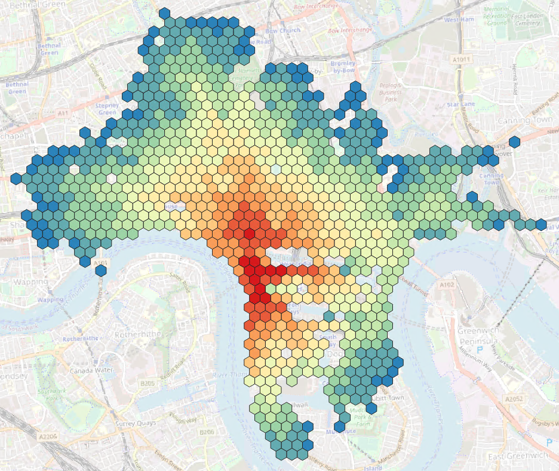
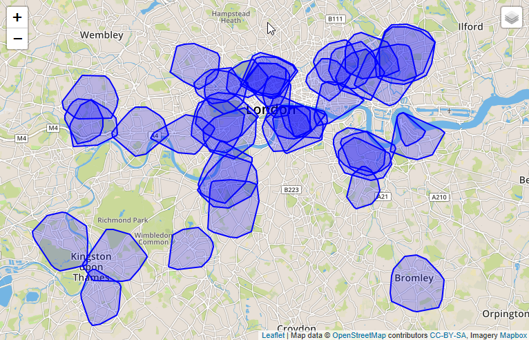
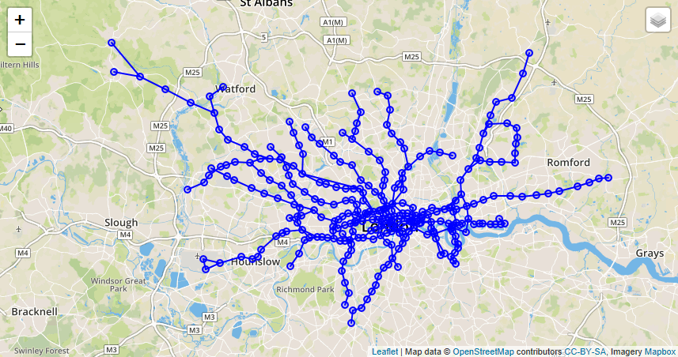
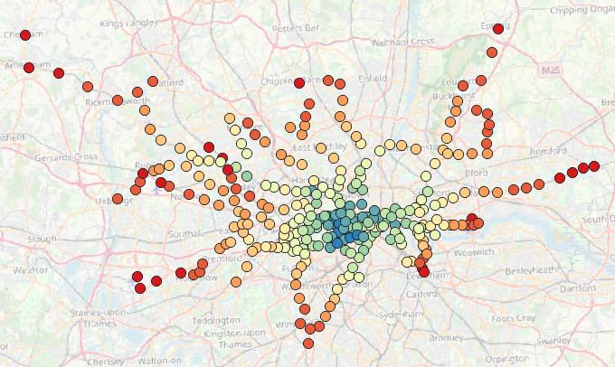

# 练习 9 - 计算等时线和接近中心性

在这个练习中，我们将探索两个更基本的功能: `Shortest Paths One-To-All` (SPOA) 和 `Breadth First Search` (BFS). 第一个很明显——给定一个起始点，它计算到图中其他每个顶点的距离/成本。SPOA可以用来计算 [isochrones](https://wiki.openstreetmap.org/wiki/Isochrone), 即具有相同驾驶时间距离的区域。[BFS](https://en.wikipedia.org/wiki/Breadth-first_search) 是许多图形算法的基本构建块，包括 [Closeness Centrality](https://en.wikipedia.org/wiki/Closeness_centrality) - 一种多重标准中心性算法，用于确定网络中某个顶点的“重要性”。<br>

## 练习 9.1 使用Shortest_Path_One_To_All <a name="subex1"></a>

Shortest_Path_One_To_All与我们在前面的练习中看到的Shortest_Path相似。顾名思义，它计算从一个开始顶点到网络中所有其他顶点的最小距离/成本。结果不是单个的“WeigthedPath”，而是一个只包含最短路径边的“Graph”。 “Graph”的顶点有一个属性“CALCULATED_COST”，它表示到达顶点所需的最小距离/成本。

`GRAPH g_spoa = SHORTEST_PATHS_ONE_TO_ALL(:g, :v_start, "CALCULATED_COST", `<br>
`(EDGE e, DOUBLE current_path_cost) => DOUBLE { `<br>
`IF(:current_path_cost < :i_max) { RETURN :e."length"/DOUBLE(:e."SPEED_MPH"); }`<br>
`ELSE { END TRAVERSE; }`<br>
`});`

```SQL
CREATE TYPE "TT_SPOA_VERTICES" AS TABLE ("osmid" BIGINT, "CALCULATED_COST" DOUBLE);

CREATE OR REPLACE PROCEDURE "GS_SPOA"(
	IN i_startVertex BIGINT, 		-- 开始顶点的key
	IN i_max DOUBLE,				-- 最大的 距离/成本
	OUT o_vertices "TT_SPOA_VERTICES"
	)
LANGUAGE GRAPH READS SQL DATA AS
BEGIN
	GRAPH g = Graph("DAT260", "LONDON_GRAPH");
	VERTEX v_start = Vertex(:g, :i_startVertex);
	-- 运行shortest_paths_one_to_all,它返回一个子图。 顶点的基于权重的路径长度存储在属性CALCULATED_COST中
	GRAPH g_spoa = SHORTEST_PATHS_ONE_TO_ALL(:g, :v_start, "CALCULATED_COST",
		(EDGE e, DOUBLE current_path_cost) => DOUBLE{
  			IF(:current_path_cost < :i_max) { RETURN :e."length"/(DOUBLE(:e."SPEED_MPH")*0.44704); }
            ELSE { END TRAVERSE; }
  		});
	o_vertices = SELECT :v."osmid", :v."CALCULATED_COST" FOREACH v IN Vertices(:g_spoa);
END;

-- 从Canary Wharf出发，300秒内我们能去哪里
CALL "GS_SPOA" (1433737988, 300, ?);
```

为了使数据可视化，让我们将其封装在一个函数中，并对图形结果进行一些后处理。使用resultType = POINTS函数将返回原始数据，即在一定的最大旅行时间内可到达的各个街道交叉口。使用resultType = CONVEXHULL函数将计算点的凸包并返回单个形状。最后，在resultType = HEXAGON的条件下，应用空间聚类算法计算每个聚类单元的平均出行时间。

```sql
CREATE OR REPLACE FUNCTION "F_SPOA_VERTICES"(
	IN i_startVertex BIGINT, 		-- 开始顶点的key
	IN i_max DOUBLE,				-- 最大的 距离/成本
	IN i_resultType NVARCHAR(20)	-- 结果类型 POINTS, CONVEXHULL, 或 HEXAGON
	)
    RETURNS TABLE("ID" BIGINT, "SHAPE" ST_GEOMETRY(32630), "CALCULATED_COST" DOUBLE)
LANGUAGE SQLSCRIPT READS SQL DATA AS
BEGIN
    CALL "GS_SPOA"(:i_startVertex, :i_max, o_path_vertices);
	IF (:i_resultType = 'POINTS') THEN
		RETURN SELECT pv."osmid" AS "ID", lv."SHAPE", pv."CALCULATED_COST"
		FROM :o_path_vertices AS pv
		LEFT JOIN "LONDON_VERTICES" lv ON pv."osmid" = lv."osmid";
	ELSEIF (:i_resultType = 'CONVEXHULL') THEN
		RETURN SELECT i_startVertex AS "ID", ST_CONVEXHULLAGGR("SHAPE") AS "SHAPE", :i_max AS "CALCULATED_COST" FROM (
		SELECT pv."osmid", lv."SHAPE", pv."CALCULATED_COST"
		FROM :o_path_vertices AS pv
		LEFT JOIN "LONDON_VERTICES" lv ON pv."osmid" = lv."osmid");
	ELSEIF (:i_resultType = 'HEXAGON') THEN
		RETURN SELECT ST_CLUSTERID() AS "ID", ST_CLUSTERCELL() AS "SHAPE", CAST(AVG("CALCULATED_COST") AS DOUBLE) AS "CALCULATED_COST" FROM (
		SELECT pv."osmid", lv."SHAPE", pv."CALCULATED_COST"
		FROM :o_path_vertices AS pv
		LEFT JOIN "LONDON_VERTICES" lv ON pv."osmid" = lv."osmid")
		GROUP CLUSTER BY "SHAPE" USING HEXAGON X CELLS 50;
	END IF;
END;
-- 再次从Canary Wharf开始探索
SELECT * FROM "F_SPOA_VERTICES"(1433737988, 60, 'POINTS') ORDER BY "CALCULATED_COST" DESC;
SELECT * FROM "F_SPOA_VERTICES"(1433737988, 60, 'CONVEXHULL') ORDER BY "CALCULATED_COST" DESC;
SELECT * FROM "F_SPOA_VERTICES"(1433737988, 240, 'HEXAGON') ORDER BY "CALCULATED_COST" DESC;
```
使用像 [Esri ArcGIS Pro](https://www.esri.com/en-us/arcgis/products/arcgis-pro/overview)或 [QGIS](https://qgis.org/en/site/about/index.html)这样的GIS应用程序，HEXAGON的结果可以用平均CALCULATED_COST进行颜色编码，从而得到如下图所示的可视化图。相同的颜色区域可以用相同的驾驶时间到达 - 这就是等时线。



假设我们想和伦敦的骑自行车的人做生意。我们的目标是开一家新的自行车修理店。为了找到合适的位置，我们可以看看现有的维修站和他们的范围。也许我们会在地图上找到一些没有太多竞争的白点。<br>
让我们计算一下伦敦所有自行车修理店周围3分钟的行驶时间。我们将使用MAP_MERGE操作来摘除多个POIs。

```sql
CREATE OR REPLACE FUNCTION "F_SPOA_VERTICES_MULTI" (IN i_filter NVARCHAR(5000), IN i_max DOUBLE, IN i_resultType NVARCHAR(20))
	RETURNS TABLE("ID" BIGINT, "SHAPE" ST_GEOMETRY(32630), "CALCULATED_COST" DOUBLE)
LANGUAGE SQLSCRIPT READS SQL DATA AS
BEGIN
	startPOIs = APPLY_FILTER("LONDON_POI", :i_filter);
	res = MAP_MERGE(:startPOIs, "F_SPOA_VERTICES"(:startPOIs."VERTEX_OSMID", :i_max, :i_resultType));
	RETURN SELECT * FROM :res;
END;

SELECT * FROM "F_SPOA_VERTICES_MULTI"(' "amenity" = ''bicycle_repair_station'' ', 180, 'CONVEXHULL');
```
结果是一组表明“良好的修理店覆盖范围”的凸壳多边形。



## 练习 9.2 使用遍历BFS实现接近中心性<a name="subex2"></a>

在接下来的演习中，我们将使用另一个网络，伦敦地铁网络。这是一个简单的数据集，其中的地铁站代表顶点，沿着地铁线的车站序列是边。




```SQL
SELECT * FROM "LONDON_TUBE_STATIONS";
SELECT * FROM "LONDON_TUBE_CONNECTIONS";

CREATE GRAPH WORKSPACE "TUBE_GRAPH"
	EDGE TABLE "LONDON_TUBE_CONNECTIONS"
		SOURCE COLUMN "SOURCE"
		TARGET COLUMN "TARGET"
		KEY COLUMN "ID"
	VERTEX TABLE "LONDON_TUBE_STATIONS"
		KEY COLUMN "ID";
```

当您以广度优先搜索的方式遍历网络时，您将逐层探索顶点。从一个顶点开始，你首先访问它所有的直接邻点，然后是邻点的邻点，以此类推。BFS是许多自定义图算法的基本构造块。在HANA中，你可以“hook”到顶点/边的“访问”事件，执行任何逻辑。

`TRAVERSE BFS ('ANY') :g FROM :v_start`<br>`
ON VISIT VERTEX (Vertex v_visited, BIGINT lvl) {`<br>
[any logic goes here]<br>
`};`

在下面的例子中，我们挂钩到VISIT VERTEX事件，并计算一个计数和成本。然后使用这些数字来推导多重接近中心性度量。

```SQL
CREATE TYPE "TT_RESULT_CC" AS TABLE (
    "ID" BIGINT, "CLOSENESS_CENTRALITY" DOUBLE, "NORMALIZED_CLOSENESS_CENTRALITY" DOUBLE, "HARMONIC_CENTRALITY" DOUBLE, "NORMALIZED_HARMONIC_CENTRALITY" DOUBLE
);
```
```SQL
CREATE OR REPLACE PROCEDURE "GS_CC_SINGLE_SOURCE"(
	IN i_start BIGINT,
	OUT o_vertices "TT_RESULT_CC"
	)
LANGUAGE GRAPH READS SQL DATA AS
BEGIN
	GRAPH g = Graph("DAT260","TUBE_GRAPH");
  -- 我们需要向顶点添加属性来存储数据
	ALTER g ADD TEMPORARY VERTEX ATTRIBUTE (DOUBLE "CLOSENESS_CENTRALITY");
	ALTER g ADD TEMPORARY VERTEX ATTRIBUTE (DOUBLE "NORMALIZED_CLOSENESS_CENTRALITY");
	ALTER g ADD TEMPORARY VERTEX ATTRIBUTE (DOUBLE "HARMONIC_CENTRALITY");
	ALTER g ADD TEMPORARY VERTEX ATTRIBUTE (DOUBLE "NORMALIZED_HARMONIC_CENTRALITY");
  -- 初始化开始顶点和一些变量
	VERTEX v_start = Vertex(:g, :i_start);
	BIGINT v_sumNodes = 0L;
	BIGINT v_sumCost = 0L;
	DOUBLE v_sumReciprocCost = 0.0;
  -- 现在我们从起点沿着任意方向的边开始遍历图。
  -- 当一个顶点被访问时，这个顶点被设为“v_visited”。它的“level”信息存储在“lvl”中。
  -- 在顶点访问事件中，我们增加访问节点的总数和总成本。
	TRAVERSE BFS ('ANY') :g FROM :v_start ON VISIT VERTEX (Vertex v_visited, BIGINT lvl) {
	    IF (:lvl > 0L){
	    	v_sumNodes = :v_sumNodes + 1L;
		    v_sumCost = :v_sumCost + :lvl;
		    v_sumReciprocCost = :v_sumReciprocCost + 1.0/DOUBLE(:lvl);
		}
	};
  -- 如果遍历完成，我们将得到最终的度量值
	IF (:v_sumCost > 0L AND :v_sumReciprocCost > 0.0 AND :v_sumNodes > 1L){
		v_start."CLOSENESS_CENTRALITY" = 1.0/DOUBLE(:v_sumCost);
		v_start."NORMALIZED_CLOSENESS_CENTRALITY" = DOUBLE(:v_sumNodes)/DOUBLE(:v_sumCost);
		v_start."HARMONIC_CENTRALITY" = :v_sumReciprocCost;
		v_start."NORMALIZED_HARMONIC_CENTRALITY" = :v_sumReciprocCost/DOUBLE(:v_sumNodes);
	}
	MULTISET<Vertex> m_v = v IN Vertices(:g) WHERE :v."CLOSENESS_CENTRALITY" >= 0.0;
	o_vertices = SELECT :v."ID", :v."CLOSENESS_CENTRALITY", :v."NORMALIZED_CLOSENESS_CENTRALITY", :v."HARMONIC_CENTRALITY", :v."NORMALIZED_HARMONIC_CENTRALITY" FOREACH v IN :m_v;
END;
```
```SQL
CALL "GS_CC_SINGLE_SOURCE"(117, ?);
```

现在网络中单个顶点的接近中心性度量还没有实际意义。我们需要计算所有顶点的中心性来找到最重要的顶点。我们可以通过在GRAPH程序中添加一个循环来做到这一点。以并行方式实现这种循环的一种好方法是使用SQLScript中的MAP_MERGE操作符。
为此，我们需要像练习8.4中那样将存储过程封装在一个函数中。
```SQL
CREATE OR REPLACE FUNCTION "F_CC_SINGLE_SOURCE"(IN i_start BIGINT)
    RETURNS "TT_RESULT_CC"
LANGUAGE SQLSCRIPT READS SQL DATA AS
BEGIN
    CALL "GS_CC_SINGLE_SOURCE"(:i_start, result);
    RETURN :result;
END;
```
接下来，我们可以以并行方式在设置的输入参数中调用此函数。
```SQL
CREATE OR REPLACE FUNCTION "F_CC_MAP_MERGE" ()
	RETURNS "TT_RESULT_CC"
LANGUAGE SQLSCRIPT READS SQL DATA AS
BEGIN
	startVertices = SELECT DISTINCT "ID" FROM "LONDON_TUBE_STATIONS";
	result = MAP_MERGE(:startVertices, "F_CC_SINGLE_SOURCE"(:startVertices."ID"));
	RETURN :result;
END;
```
```SQL
SELECT * FROM "F_CC_MAP_MERGE"() ORDER BY "NORMALIZED_CLOSENESS_CENTRALITY" DESC;
```
同样，我们可以将来自graph函数的结果与其他SQL操作(如JOIN)混合使用。
```SQL
SELECT *
  FROM "F_CC_MAP_MERGE"() AS C
	LEFT JOIN "LONDON_TUBE_STATIONS" AS S
  ON C."ID" = S."ID"
	ORDER BY "NORMALIZED_CLOSENESS_CENTRALITY" DESC;
```
使用先进的可视化GIS应用程序，我们看到了地铁站，其中蓝色的点网络中首要的中心点。



## 总结

现在您已经看到了如何使用Shortest_Path_One_To_All和遍历BFS。

继续到 - [概要页](../../README.md)
