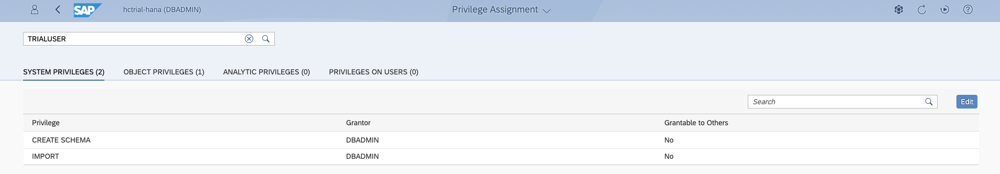

# Getting Started

This section should get you started by going through all technical pre-requisites. Additionally you will be introduced to the dataset and some background information and material will be given.

## Setup SAP HANA Cloud Trial Instance 
- create instance
- graph and spatial is there
- create user other than dbadmin and assign right for importing catalog objects

- access db explorer

## Base Data & Demo Scenario 
The data for the exercises is packaged as a HANA database export. The [export file](../data/DAT260.tar.gz) is in the data folder. Please download the file to your local computer.

Once you downloaded the export file, you use the Database Explorer to connect to you HANA Cloud system. Right-click "Catalog" and choose "import catalog objects" to start the wizard.

- execute test script to see that spatial and graph is working

After import, you'll find 5 tables in the schema "DAT260". There is **LONDON_POI** which contains 90k points of interest in the London area. This includes pubs and bike repair shops. The street network data is in **LONDON_EDGES**, which represents the actual 1.5 million street segments, and **LONDON_VERTICES**, which describes the 800,000 road junctions. Finally, there are two tables containing data of the London Tube system - station and connections.

The data was downloaded using the [osmnx](https://github.com/gboeing/osmnx) python package and imported into HANA using the [Python Machine Learning Client for SAP HANA](https://pypi.org/project/hana-ml/).

## Spatial Visualizations 
- dbeaver
- wicket with st_transform and st_aswkt
- st_assvg and browser (increase clob limit)

## General Structure of Exercises 
- exercise text and solution
- 1-5 = spatial
- 6-9 = graph

## Background Material 
- devtoberfest
- spatial reference
- graph reference
- blogs

## Summary
You should now have an overview of the technical pre-requisites as well as the necessary background information to master the exercises of DAT260!

Continue to - [Exercise 1 - Add Planar Geometries Based on WGS84 Geometries](../ex1/README.md)
