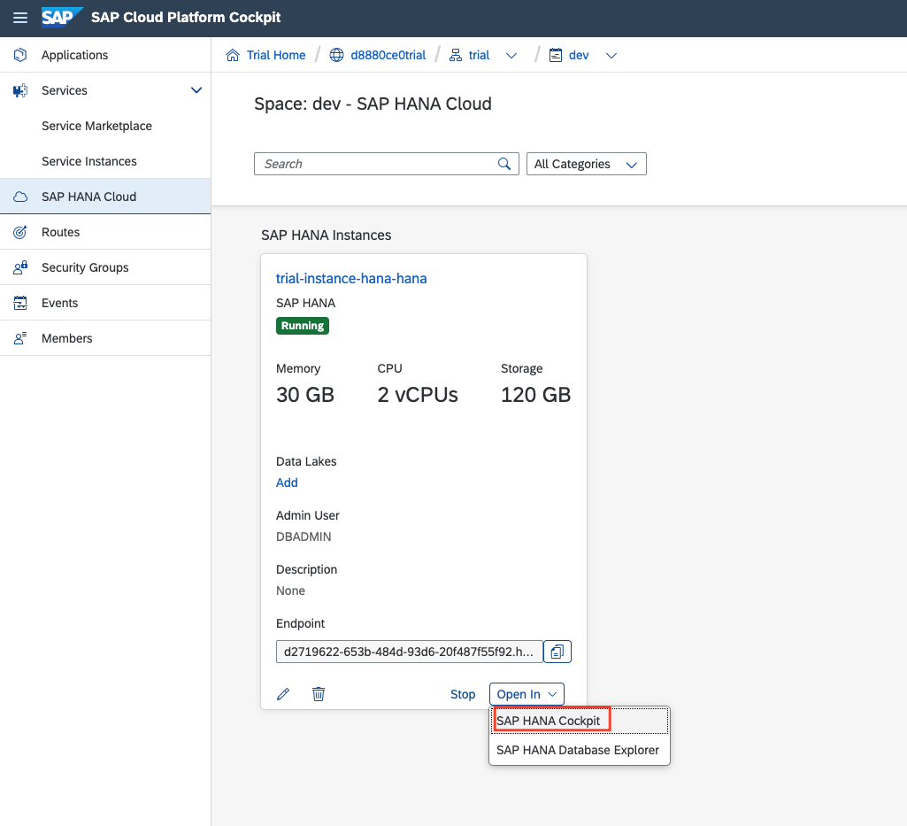
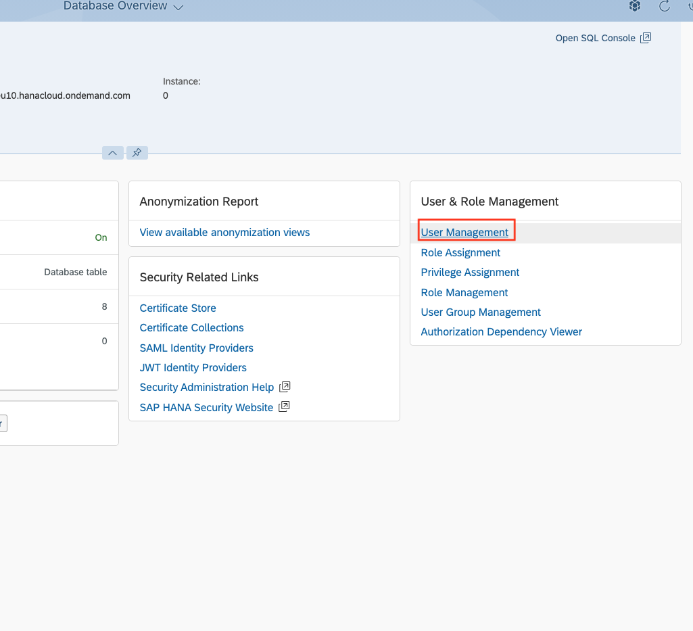
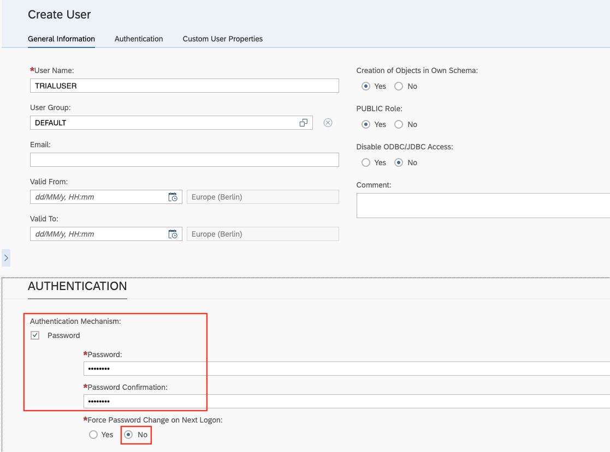

# Getting Started

This section should get you started by going through all technical pre-requisites. Additionally you will be introduced to the dataset and some background information and material will be given.

## Setup SAP HANA Cloud Trial Instance 

SAP HANA Cloud is a service on the SAP Cloud Platform.
First of all, you need to register for the 30-days free trial of SAP HANA Cloud.
To do so, click on this [link](https://www.sap.com/registration/trial.9a2d77fd-9c7a-48d7-b618-5b83ba9d0445.html) and follow the process.

After registering for the SAP HANA Cloud trial, here's how to access your SAP HANA Cloud trial:

  1. Go to the [SAP Cloud Platform trial home](https://account.hanatrial.ondemand.com/register). This takes you to the SAP Cloud Platform Cockpit.

  2. Click on the "Enter Your Trial Account" button. This takes you to the SAP Cloud Platform 

  3. Click on the "trial" subaccount tile.

  4. Under Spaces, click on the "dev" space.

  5. Click on "SAP HANA Cloud" in the left navigation menu. 
  
  6. Now you can create an SAP HANA Cloud trial instance with the button on the top right. Find more details on how to do so [here](https://help.sap.com/viewer/db19c7071e5f4101837e23f06e576495/2020_03_QRC/en-US/784a1dbb421a4da29fb1e3bdf5f198ec.html). Bear in mind to remember your password.

You're now in the SAP HANA Cloud trial! 
As soon as the database instance is created and running, go to the SAP HANA Cockpit to create an additional user.

To do so, click the "Open In" button and select "SAP HANA Cockpit".

Within the SAP HANA Cockpit, select the "Security and User Management" View.

Select the "User Management" option on the right.

Create a new user by clicking the "+" button.

Provide a user name and select the password option. Bear in mind to remember the password.
This user will later be used to connect to SAP HANA Cloud.
Select "Save" on the bottom right.

Go back to the Home page and select "Privilege Assignment" to assign the required privileges to the newly created user.

Select your newly created user and assign the privileges "CREATE SCHEMA" and "IMPORT" to the user.

Great! You configured your SAP HANA Cloud instance to be ready to start with the exercises.
Now, go back to SAP Cloud Platform and open the SAP HANA Database Explorer via "Open In".

Keep in mind to login with the newly created user.
Now, you are ready to go with the exercises! Have fun!

## Base Data & Demo Scenario 
The data for the exercises is packaged as a HANA database export. The [export file](../data/DAT260.tar.gz) is in the data folder. Please download the file to your local computer.

Once you downloaded the export file, you can use the Database Explorer to connect to your HANA Cloud system. Right-click "Catalog" and choose "import catalog objects" to start the wizard.

After import, you'll find 5 tables in the schema "DAT260". There is **LONDON_POI** which contains 90k points of interest in the London area. This includes pubs and bike repair shops. The street network data is in **LONDON_EDGES**, which represents the actual 1.5 million street segments, and **LONDON_VERTICES**, which describes the 800,000 road junctions. Finally, there are two tables containing data of the London Tube system - station and connections.

The data was downloaded using the [osmnx](https://github.com/gboeing/osmnx) python package and imported into HANA using the [Python Machine Learning Client for SAP HANA](https://pypi.org/project/hana-ml/).

## Spatial Visualizations 
- dbeaver
- wicket with st_transform and st_aswkt or geojson.io with st_asgeojson
- st_assvg and browser (increase clob limit)

## General Structure of Exercises 
The following nine exercises are design to give you insights into spatial and graph processing with SAP HANA Cloud. We will provide you with sample data to experiment with SAP PHANA Cloud and experience the advantages of the multi-model engine.
While the first five exercises focus on SAP HANA Spatial, the last four exercises focus on SAP HANA Graph.

## Background Material 

If you are interested in more information or seek for more guidance or demos, check out the resources below:
[SAP HANA Spatial Reference Guide](https://help.sap.com/viewer/bc9e455fe75541b8a248b4c09b086cf5/)
[SAP HANA Graph Reference Guide](https://help.sap.com/viewer/11afa2e60a5f4192a381df30f94863f9)
[SAP HANA Multi-model @ Devtoberfest](https://www.youtube.com/playlist?list=PL6RpkC85SLQA8za7iX9FRzewU7Vs022dl)

## Summary
You should now have an overview of the technical pre-requisites as well as the necessary background information to master the exercises of DAT260!

Continue to - [Exercise 1 - Add Planar Geometries Based on WGS84 Geometries](../ex1/README.md)
