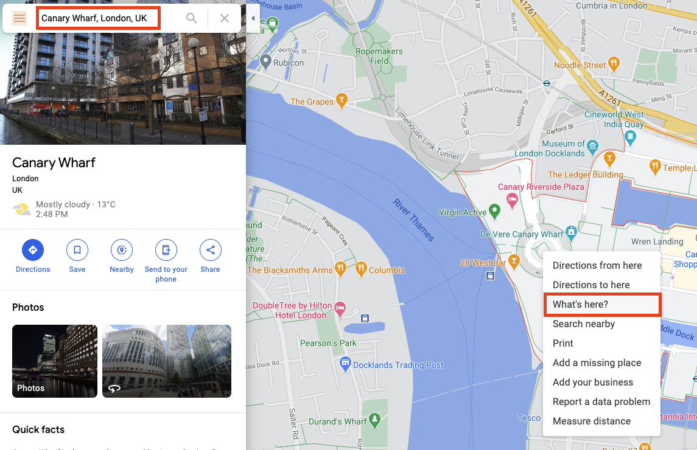
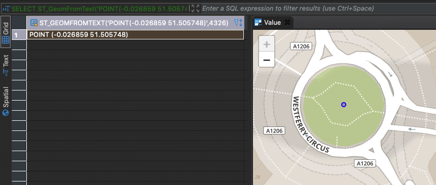
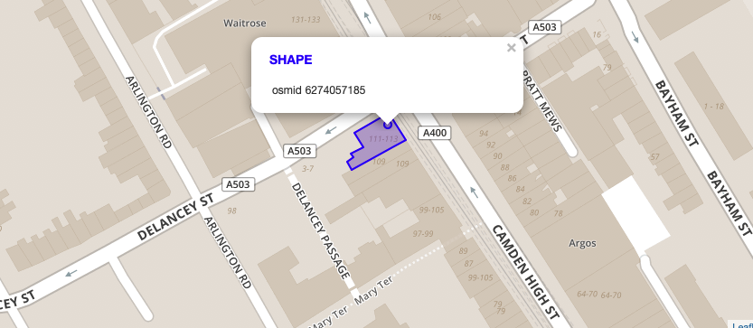

# Exercise 2 - Determine Distance to Target Point of Interest (POI)

Imagine you are done working for today, step out of the office and want to go to a bar in London to grab your well-deserved home made iced tea.

In this exercise, you will calculate the distance between your location and a POI of type
`bar` in table `LONDON_POI`.

## Exercise 2.1 - Select a Location via SQL <a name="subex1"></a>
---
**You are starting your trip at Canary Wharf in London. Write a select statement reflecting the location as type `ST_Geometry`**

---

First, you will need to find the latitude and longitude of your location. Web mapping services like Google Maps can help here. Visit [maps.google.com](https://www.google.com/maps) and zoom-in to Canary Wharf in London. Right-click on the big round-about and select `What's here?`.



You can retrieve the coordinates from the small overlay at the bottom of the windows or copy and paste from the current url.


To feed these coordinates into SAP HANA on the SQL console, we can use function [`ST_GeomFromText`](https://help.sap.com/viewer/bc9e455fe75541b8a248b4c09b086cf5/2020_03_QRC/en-US/7a194a8e787c1014bed49b5134e6b930.html). This constructor for geometries expects a [Well-known Text (WKT)](https://en.wikipedia.org/wiki/Well-known_text_representation_of_geometry) as well as the associated spatial reference system as input. Latitude and longitude can be easily assembled to match the expected WKT string. The associated spatial reference system in this case has id 4326 (WGS84).

```sql
SELECT ST_GeomFromText('POINT(-0.026859 51.505748)', 4326) FROM DUMMY;
```

If you use an SQL editor with built-in spatial visualization, like [DBeaver](https://dbeaver.io/), you will be able to preview the location and double-check that it matches your previously selected location.


To make the following exercises more convenient, it is a good idea to transform this point to the same spatial reference system as our OSM data (srs with id 32630). We can extract the Well-known Text representation by using function [`ST_AsWKT`](https://help.sap.com/viewer/bc9e455fe75541b8a248b4c09b086cf5/2020_03_QRC/en-US/7a169dff787c1014a095b86992806f14.html).

```sql
SELECT ST_GeomFromText('POINT(-0.026859 51.505748)', 4326)
    .ST_Transform(32630)
    .ST_AsWKT()
FROM DUMMY;
```

Result:
```
POINT (706327.107445 5710259.94449)
```

We can now select the point with spatial reference system 32630 by calling the following statement.

```sql
SELECT ST_GeomFromText('POINT (706327.107445 5710259.94449)', 32630) FROM DUMMY;
```

## Exercise 2.2 - Select Target POI <a name="subex2"></a>
---
**You want to end your trip at a bar called _Blues Kitchen_ in Camden. Select the respective entry from table `LONDON_POI`.**

---

All points of interest are stored in table `LONDON_POI`. We can search our POI based on field `name`and `amenity`. The latter describes the type of POI. In our case we would like to filter for value `bar`.

```sql
SELECT * 
FROM LONDON_POI lp 
WHERE LOWER("name") LIKE '%blues kitchen%' AND "amenity" = 'bar'
```

You should receive 4 records in the result set. If you do not have a visualization tool installed, you can use online tools such as [Wicket](https://arthur-e.github.io/Wicket/sandbox-gmaps3.html). Wicket is able to visualize geometries in WKT format in spatial reference system 4326. To obtain these geometries from HANA we can use [ST_Transform](https://help.sap.com/viewer/bc9e455fe75541b8a248b4c09b086cf5/2020_03_QRC/en-US/e2b1e876847a47de86140071ba487881.html) in combination with [ST_AsWKT](https://help.sap.com/viewer/bc9e455fe75541b8a248b4c09b086cf5/2020_03_QRC/en-US/7a169dff787c1014a095b86992806f14.html). 

```sql
SELECT "osmid", SHAPE.ST_Transform(4326).ST_AsWKT() 
FROM LONDON_POI lp 
WHERE LOWER("name") LIKE '%blues kitchen%' AND "amenity" = 'bar'
```

When you copy over the geometries in WKT format to your online visualizer, you will see that two records are not located in Camden and the two other records are actually referring to the same location - one being a polygon depicting the outline of the building and the other being a point depicting the location of the building.



In the following we will work with the POI with OSM ID (field `osmid`) **6274057185**.

```sql
SELECT * FROM LONDON_POI lp WHERE "osmid" = 6274057185
```


## Exercise 2.3 - Determine Distance using ST_Distance <a name="subex3"></a>
---
**Determine the direct distance between your location and the selected POI.**

---

We already know how to select our location, which is the start of our journey, and how to select the target POI. We need to use function [ST_Distance](https://help.sap.com/viewer/bc9e455fe75541b8a248b4c09b086cf5/2020_03_QRC/en-US/7a182aa3787c101481f996e3d419c720.html) to determine the direct distance between both points.

```sql
SELECT SHAPE.ST_Distance(
        ST_GeomFromText('POINT (706327.107445 5710259.94449)', 32630)
    ) 
FROM LONDON_POI lp 
WHERE "osmid" = 6274057185
```

Triggering the query above, we will come to the conclusion that the direct distance to reach our home made iced tea is around 8670 meter.

## Summary

You have successfully created a geometry out of a WKT string. Furthermore you have visualized points of interest by either using DBeaver or an online visualization tool like Wicket. With the spatial function ST_Distance you have determined the direct distance between two points.

Continue to - [Exercise 3 - Identify Relevant Area for Transportation Network](../ex3/README.md)
