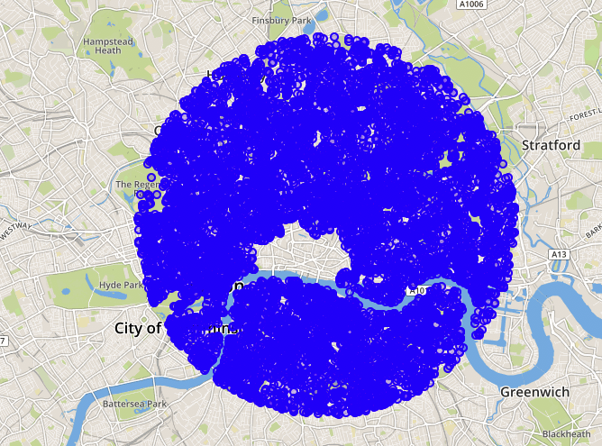

# Exercise 3 - Identify Relevant Area for Transportation Network

Now, that we have identified the direct distance from our location to the target, we would like to identify the area, that is relevant to get from start to target. Instead of finding the path while considerung the whole transportation network, we would like to select a meaningful sub-network.

## Exercise 3.1 - Create Circle for Relevant Area <a name="subex1"></a>
---
**Construct a circle to identify the relevant area for the transportation network. The circle should have a minimal size and should contain origin and destination with a buffer of 500 meter around it.**

---

In the following we will build our query step-by-step using sub-selects to make the approach and the resulting SQL statement better understandable.

Notice, that the center point of the smallest circle, which includes two points, is the center point of their direct connection line.

The two points we are looking at from the previous exercises are the following.
```sql
SELECT 
	ST_GeomFromText('POINT (706327.107445 5710259.94449)', 32630) AS START_PT,
	SHAPE AS TARGET_PT
FROM LONDON_POI lp 
WHERE "osmid" = 6274057185;
```

To create a line geometry, which is connecting both points, we can use function [`ST_MakeLine`](https://help.sap.com/viewer/bc9e455fe75541b8a248b4c09b086cf5/2020_03_QRC/en-US/57758b2af95346db9a478a53ec2c4ccb.html).
```sql
SELECT ST_MakeLine(START_PT, TARGET_PT) AS CONN_LINE
FROM 
(
	-- previous statement
);
```
To retrieve an arbitrary point on this line, we need to use function [`ST_LineInterpolatePoint`](https://help.sap.com/viewer/bc9e455fe75541b8a248b4c09b086cf5/2020_03_QRC/en-US/c8efe60825514403865090fdf1dc1550.html), which takes a fraction of the line as argument. For retrieving the center point of the line, we pass the value `0.5`.
```sql
SELECT CONN_LINE.ST_LineInterpolatePoint(0.5) AS CENTER_PT
FROM 
(
	-- previous statement
);
```

As a final step, we would like to draw a circle with radius `distance(start, target)/2 + 500` around `CENTER_PT`. The respective function, which takes the radius as an input, is called [`ST_Buffer`](https://help.sap.com/viewer/bc9e455fe75541b8a248b4c09b086cf5/2020_03_QRC/en-US/010c53e227a94966bb009d52d9ec47a2.html).
```sql
SELECT CENTER_PT.ST_Buffer(4835) AS AREA
FROM
(
    -- previous statement
);
```

The above steps can be combined into a single select using method chaining.
```sql
SELECT 
    ST_MakeLine( 
        ST_GeomFromText('POINT (706327.107445 5710259.94449)', 32630),
        SHAPE
    )
    .ST_LineInterpolatePoint(0.5)
    .ST_Buffer(5000) AS AREA
FROM LONDON_POI
WHERE "osmid" = 6274057185;
```

The below picture illustrates, how we have constructed the circle for selecting the relevant transportation sub-network.


## Exercise 3.2 - Add Flag for all Nodes in Circle <a name="subex2"></a>
---
**Flag all nodes of the transporation network, which are located in the circle, by setting `in_scope = true`.**

---

First, we need to enhance the existing vertex table by column `in_scope`.
```sql
ALTER TABLE LONDON_VERTICES ADD (IN_SCOPE INTEGER);
```

Second, we fill the column with `0` or `1` based on the intersection with the identified area. We can use function [`ST_Intersects`](https://help.sap.com/viewer/bc9e455fe75541b8a248b4c09b086cf5/2020_03_QRC/en-US/7a19e197787c1014a13087ee8f970cce.html) to determine, if two geometries intersect or not.

Instead of using an [`UPDATE`](https://help.sap.com/viewer/c1d3f60099654ecfb3fe36ac93c121bb/2020_03_QRC/en-US/20ff268675191014964add3d17700909.html) statement, we will use [`MERGE INTO`](https://help.sap.com/viewer/c1d3f60099654ecfb3fe36ac93c121bb/2020_03_QRC/en-US/3226201f95764a57810dd256c9524d56.html), which allows a more complex update logic.

```sql
MERGE INTO LONDON_VERTICES lv
USING 
(
	-- previous statement begin --
	SELECT 
    	ST_MakeLine( 
        	ST_GeomFromText('POINT (706327.107445 5710259.94449)', 32630),
        	SHAPE
    	)
    	.ST_LineInterpolatePoint(0.5)
    	.ST_Buffer(5000) AS AREA
	FROM LONDON_POI
	WHERE "osmid" = 6274057185
    	-- previous statement end --
) circle ON 1=1
WHEN MATCHED THEN UPDATE SET lv.IN_SCOPE = CIRCLE.AREA.ST_Intersects(SHAPE);

```

We can confirm that we properly selected the nodes by visualizing the result set of following query.
```sql
SELECT SHAPE FROM LONDON_VERTICES WHERE IN_SCOPE = 1;
```



## Summary

You have identified a sub-network for transportation, which you will consider for finding your path through London in the following exercises.

Continue to - [Exercise 4 - Check out the Suitability of this Area for Bike Rides](../ex4/README.md)
