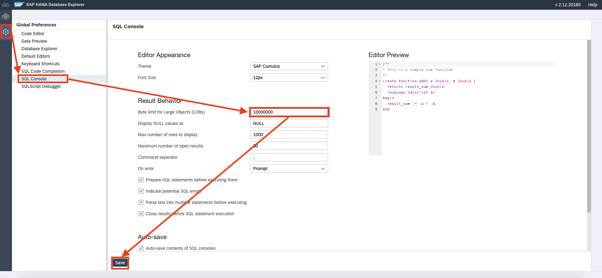
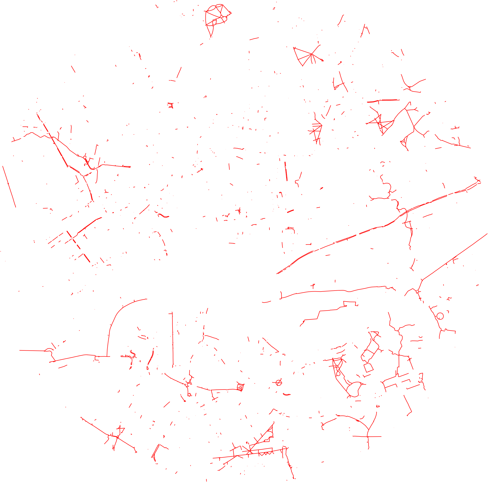
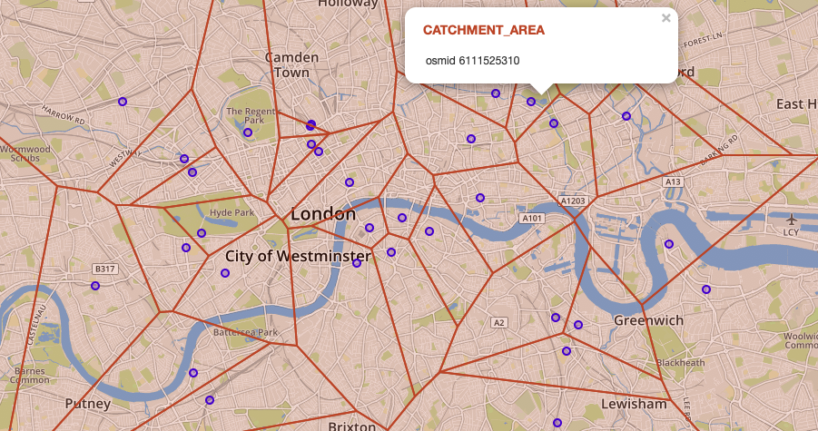

# Exercise 4 - Check out the Suitability of this Area for Bike Rides

Now that we have identified the target of our trip as well as the relevant area for transportation, we need determine the suitability of the network for taking the trip with a a bike. In case we haven't mentioned yet: A bicylce. That's our vehicle to get the bar.

## Exercise 4.1 - Identify Cycleways <a name="subex1"></a>
---
**Select edges with property `highway = 'cycleway'` in the previously identified area**

---

Additionally to the filter for `highway = 'cycleway'`, we need to check if both of the associated vertices are within the scope of our area of interest. If only one connected vertex is within the scope of our circle, this would mean that we would leave the area of interest by passing this edge (i.e. street).

```sql
SELECT le.* 
FROM LONDON_EDGES le 
JOIN LONDON_VERTICES u ON le.SOURCE = u."osmid" 
JOIN LONDON_VERTICES v ON le.TARGET = v."osmid" 
WHERE u.IN_SCOPE = 1 AND v.IN_SCOPE = 1 AND "highway" = 'cycleway'
```

## Exercise 4.2 - Create a Scalable Vector Graphic (SVG) to Visualize Cycleways <a name="subex2"></a>
---
**Aggregate the cycleways found above and create a vector graphic (SVG) to display the structure of cycleways in the city of London.**

---

To perform a spatial union operation and construct one geometrie out of the result set of the above query, we use [`ST_UnionAggr`](https://help.sap.com/viewer/bc9e455fe75541b8a248b4c09b086cf5/2020_03_QRC/en-US/601aa9fb93e241af96faafcb8f01b12e.html).

One of HANA's output formats for geometries is [Scalable Vector Graphic (SVG)](https://en.wikipedia.org/wiki/Scalable_Vector_Graphics). The appropriate function for generating an SVG representation of a geometry is called [`ST_AsSVG`](https://help.sap.com/viewer/bc9e455fe75541b8a248b4c09b086cf5/2020_03_QRC/en-US/ef447b3e0a964cd5bbe82074f4225f84.html). We can handover optional parameters for custom styling of the SVG.

> **Note**<br>
> To see (& copy) the full SVG output in DB Explorer, you will need to increase the 'Byte limit for Large Objects (LOB)'. You can set the value to `0`, which will be automatically converted to the maximum possible value.
> 

The following query creates the SVG as a CLOB:
```sql
SELECT ST_UnionAggr(le.SHAPE).ST_AsSVG(Attribute=>'stroke="red" stroke-width="0.1%"')
FROM LONDON_EDGES le 
JOIN LONDON_VERTICES u ON le.SOURCE = u."osmid" 
JOIN LONDON_VERTICES v ON le.TARGET = v."osmid" 
WHERE u.IN_SCOPE = 1 AND v.IN_SCOPE = 1 AND le."highway" = 'cycleway'
```

To view the SVG, simply copy&paste the output into a file and give it a name with ending '.svg'. You can view the SVG file by opening it with your browser.

Original SVG (no screenshot!):


## Exercise 4.3 - Use Voronoi to Understand the Coverage of Bike Repair Stations <a name="subex3"></a>
---
**Select all bicycle repair stations and determine their catchment area using a Voronoi diagram.**

---

Finding bicycle repair stations is easy, since the field `amenity` carries the value `bicycle_repair_station` for such POIs.

```sql
SELECT *
FROM LONDON_POI
WHERE "amenity" = 'bicycle_repair_station'
```

The [Voronoi cell](https://en.wikipedia.org/wiki/Voronoi_diagram) (also known as Thiessen polygon) of a POI covers the area that is close to this POI than to any other POI in the list. The spatial windows function [`ST_VoronoiCell`](https://help.sap.com/viewer/bc9e455fe75541b8a248b4c09b086cf5/2020_03_QRC/en-US/901a780341dc41c5b4c2e8c58975d2af.html) lets you create Voronoi cells on the database level.

```sql
SELECT
	"osmid" ,
    SHAPE,
	ST_VoronoiCell(SHAPE, 10.0) OVER () AS CATCHMENT_AREA
FROM LONDON_POI 
WHERE "amenity" LIKE 'bicycle_repair_station'
```

The Voronoi cells can be used to determine, which is the closest bicycle repair station to any location in the city.



## Summary

You've learnt about the suitability of the transportation network for bike rides. For this, you have visualized the coverage with cycle ways as well as bicycle repair stations.

Continue to - [Exercise 5 - Snap POIs to Nodes of Street Network](../ex5/README.md)