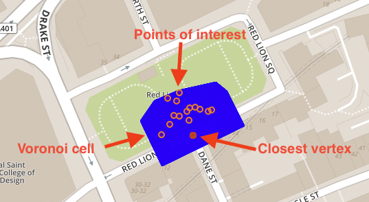

# Exercise 5 - Snap POIs to Nodes of Street Network

In our dataset we have points of interest (table `LONDON_POI`) as well as nodes of the transportation network (table `LONDON_VERTICES`). Of course, there is a spatial relation between both (e.g. distance measured by `ST_Distance`). In this exercise, we would like to assign each POI to its closes node in the transportation network. You can think of assigning a `bar` to its closest street corner.

This way, we will be able to later on calculate shortest paths between points of interest.


## Exercise 5.1 - Persist Voronoi Cells for all Nodes <a name="subex1"></a>
---
**Enhance table `LONDON_VERTICES` by a column `VORONOI_CELL` that holds the Voronoi cell of the respective vertex/node as an `ST_Geometry`**

---

First, we need to enhance the existing table.
```sql
ALTER TABLE LONDON_VERTICES ADD (VORONOI_CELL ST_Geometry(32630));
```

Second, we use [`MERGE INTO`](https://help.sap.com/viewer/c1d3f60099654ecfb3fe36ac93c121bb/2020_03_QRC/en-US/3226201f95764a57810dd256c9524d56.html) to update the values and assign it with the respective Voronoi cell.
```sql
MERGE INTO LONDON_VERTICES
USING
(
	SELECT "osmid", ST_VoronoiCell(shape, 10.0) OVER () AS CELL
	FROM LONDON_VERTICES
) v ON LONDON_VERTICES."osmid" = v."osmid"
WHEN MATCHED THEN UPDATE SET LONDON_VERTICES.VORONOI_CELL = v.CELL;
```

## Exercise 5.2 - Persist Centroid for each Point of Interest <a name="subex2"></a>
---
**Enhance table `LONDON_POI` by a column `SHAPE_CENTROID`that holds the centroid of the respective point of interest. Note, that many POIs are actually polygons.**

---

We need to enhance table `LONDON_POI` by another geometry with spatial reference system `32630`.
```sql
ALTER TABLE LONDON_POI ADD (SHAPE_CENTROID ST_GEOMETRY(32630));
```

Since POIs in the OpenStreetMap data can contain points as well as polygon (i.e. storing the shape of a house), the column `SHAPE` in table `LONDON_POI` contains a mixture of points and polygons. We want to copy over the points to column `SHAPE_CENTROID` and - in case of polygons - calculate their centroid and assign the resulting point to column `SHAPE_CENTROID`.

We will use function [`ST_GeometryType`](https://help.sap.com/viewer/bc9e455fe75541b8a248b4c09b086cf5/2020_03_QRC/en-US/7a190326787c10148831cde7ab32410d.html) to determine if the record contains point or polygon and function [`ST_Centroid`](https://help.sap.com/viewer/bc9e455fe75541b8a248b4c09b086cf5/2020_03_QRC/en-US/7a2b9111787c1014926c93c8506930b1.html) to calculate the centroid of the latter.

```sql
UPDATE LONDON_POI 
SET SHAPE_CENTROID = 
    CASE 
        WHEN SHAPE.ST_GeometryType() = 'ST_Point' 
        THEN SHAPE 
        ELSE SHAPE.ST_Centroid() 
    END;
```

## Exercise 5.3 - Enhance POI Table with Node Reference <a name="subex3"></a>
---
**Connect each POI with its closest vertex in the transportation network. For this, enhance table `LONDON_POI` with a column `VERTEX_OSMID` and fill in the `osmid` of the closest vertex.**

---

For physically enhancing the table, we need to consider that the referenced `osmid` in table `LONDON_VERTICES` is of type `BIGINT`.
```sql
ALTER TABLE LONDON_POI ADD (VERTEX_OSMID BIGINT);
```

We have learnt in the previous exercise about the definition and usage of Voronoi cells. We will use the already persisted Voronoi cells to determine the closest vertex for each POI. Note, that if a POI is within the Voronoi cell of a specific vertex, that means that this vertex is closer to the POI than any other vertex.

Given that knowledge, we can use spatial function [`ST_Intersects`](https://help.sap.com/viewer/bc9e455fe75541b8a248b4c09b086cf5/2020_03_QRC/en-US/7a19e197787c1014a13087ee8f970cce.html) to assign a vertext to each POI in the dataset.
```sql
MERGE INTO LONDON_POI lp
USING LONDON_VERTICES lv
ON lv.VORONOI_CELL.ST_Intersects(lp.SHAPE_CENTROID) = 1
WHEN MATCHED THEN UPDATE SET lp.VERTEX_OSMID = lv."osmid"; 
```

This picture illustrates the snapping logic.



## Summary

You've now connected each point of interested to a node/vertex in the transportation network. This will enable you in the following exercises to calculate shortest paths between POIs.

Continue to - [Exercise 6 - Prepare data for the Graph Engine and create a Graph Workspace](../ex6/README.md)
