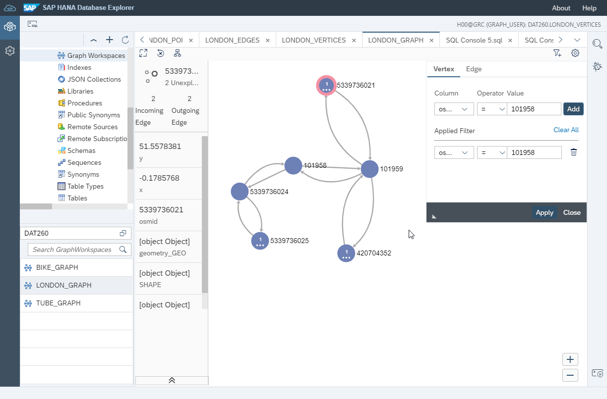

# Exercise 6 - Prepare data for the Graph Engine and create a Graph Workspace

Our graph dataset describes the London street network. Formally, a graph consists of nodes/vertices and edges/links/connections. In our case, we have street segments stored in the `LONDON_EDGES` table, and junctions in the `LONDON_VERTICES` table. The edges in the graph are "directed", they have a SOURCE and a TARGET. Most streets in the real world are bi-directional and so most of the segments are represented as two edges in the graph - one for each direction.

The SAP HANA Graph engine requires a key on both tables, and the source and target of the edges must not contain NULLs. To ensure the graph's consistency, it is also good practice to have a foreign key relationship defined on source and target column. Doing so will prevent "dangling edges", i.e. edges without vertices.
Once your data is prepared, you expose it to the SAP HANA Graph engine via a GRAPH WORKSPACE.

## Exercise 6.1 Define required Constraints on the Tables <a name="subex1"></a>
---
**Create primary keys on the LONDON_EDGES and LONDON_VERTICES tables, and foreign keys on the SOURCE and TARGET column.**

---

```sql
ALTER TABLE "LONDON_EDGES" ADD PRIMARY KEY("ID");
ALTER TABLE "LONDON_VERTICES" ADD PRIMARY KEY("osmid");

ALTER TABLE "LONDON_EDGES" ALTER("SOURCE" BIGINT NOT NULL REFERENCES "LONDON_VERTICES" ("osmid") ON UPDATE CASCADE ON DELETE CASCADE);
ALTER TABLE "LONDON_EDGES" ALTER("TARGET" BIGINT NOT NULL REFERENCES "LONDON_VERTICES" ("osmid") ON UPDATE CASCADE ON DELETE CASCADE);
```

## Exercise 6.2 Create a Graph Workspace <a name="subex2"></a>
---
**Create a `GRAPH WORKSPACE` on top of the LONDON_EDGES and LONDON_VERTICES tables.**

---
The Graph Workspace exposes your data to the SAP HANA graph engine. It is a kind of a "view" into your data. In our case, the Graph Workspace is defined directly on the tables. Note that you can also use SQL views, table functions, and remote tables as data sources. You can define multiple Graph Workspaces in one system.
```sql
CREATE GRAPH WORKSPACE "LONDON_GRAPH"
	EDGE TABLE "LONDON_EDGES"
		SOURCE COLUMN "SOURCE"
		TARGET COLUMN "TARGET"
		KEY COLUMN "ID"
	VERTEX TABLE "LONDON_VERTICES"
		KEY COLUMN "osmid";
```

To get a glimpse of your network, you can right-click the LONDON_GRAPH workspace to launch the graph viewer.



## Summary

We have defined constraints on our `LONDON_VERTICES` and `LONDON_EDGES` table and created a `GRAPH WORKSPACE`. We are all set up to run some graph stuff.

Continue to - [Exercise 7 - Use a GRAPH Procedure to calculate Shortest Paths on the street network ](../ex7/README.md)
