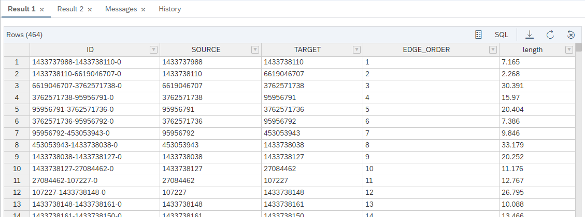

# Exercise 7 - Use a GRAPH Procedure to calculate Shortest Paths on the Street Network
Once you have a `GRAPH WORKSPACE` defined, you can run [openCypher](https://www.opencypher.org/) queries for [pattern matching](https://help.sap.com/viewer/11afa2e60a5f4192a381df30f94863f9/2020_03_QRC/en-US/4c3ee700e7a8458baed3f1141d9380f3.html) workload, or create GRAPH procedures for network analysis. In this exercise we will create a database procedure that uses the built-in function to calculate a shortest path between two vertices.

## Exercise 7.1 Define required Table Type for the Procedure <a name="subex2"></a>
---
**Create a `TABLE TYPE` that describes the output table of the procedure, containing ID, SOURCE, TARGET, EDGE_ORDER (BIGINT), and length (DOUBLE)**

---
If you are familiar with SAP HANA database procedures using SQLScript, you already know how to handle table-like results. A clean way to do this is by defining and using `TABLE TYPES`. The same approach is valid for GRAPH procedures. Our TABLE TYPE `TT_SPOO_EDGES` describes the structure of the path result. It includes the ID of the edge and the ORDER in which the edges are traversed.

```sql
CREATE TYPE "TT_SPOO_EDGES" AS TABLE (
    "ID" VARCHAR(5000), "SOURCE" BIGINT, "TARGET" BIGINT, "EDGE_ORDER" BIGINT, "length" DOUBLE)
;
```

## Exercise 7.2 Create a GRAPH Procedure for Shortest Path Calculation <a name="subex2"></a>
---
**Create a GRAPH procedure, using the built-in Shortest_Path function.**

---
The procedure below looks similar to a SQLScript procedure - the header describes input and output variables, followed by the actual code. The code below is a graph specific programming language called GRAPH. Instead of working with relational objects and operations like tables and SQL, GRAPH procedures operate on vertices and edges. The core of this procedure is the call of the built-in graph algorithm:

`WeightedPath<BIGINT> p = Shortest_Path(:g, :v_start, :v_end, :i_direction);`

where `g` is our graph, `v_start` and `v_end` are the start/end vertices of the path we are searching, and `i_direction` indicates the direction in which edges can be traversed (OUTGOING, INCOMING, or ANY). The result is assigned to a path object `p`.

```sql
CREATE OR REPLACE PROCEDURE "GS_SPOO"(
	IN i_startVertex BIGINT,       -- INPUT: the ID of the start vertex
	IN i_endVertex BIGINT,         -- INPUT: the ID of the end vertex
	IN i_direction NVARCHAR(10),   -- INPUT: the direction of the edge traversal: OUTGOING (default), INCOMING, ANY
	OUT o_path_length BIGINT,      -- OUTPUT: the hop distance between start and end
	OUT o_edges "TT_SPOO_EDGES" -- OUTPUT: a table containing the edges that make up a shortest path between start and end
	)
LANGUAGE GRAPH READS SQL DATA AS BEGIN
	-- Create an instance of the graph, referring to the graph workspace object
	GRAPH g_all = Graph("DAT260", "LONDON_GRAPH");
  -- Using the IN_SCOPE attribute created in "Exercise 3 Identify Relevant Area for Transportation Network" to narrow down the search scope
  GRAPH g = SubGraph(:g_all, v IN Vertices(:g_all) WHERE :v."IN_SCOPE" == 1);
	-- Create an instance of the start/end vertex
	VERTEX v_start = Vertex(:g, :i_startVertex);
	VERTEX v_end = Vertex(:g, :i_endVertex);
	-- Runnning shortest path one-to-one based hop distance, i.e. the minimum number of edges between start and end
	WeightedPath<BIGINT> p = Shortest_Path(:g, :v_start, :v_end, :i_direction);
	o_path_length = LENGTH(:p);
	o_edges = SELECT :e."ID", :e."SOURCE", :e."TARGET", :EDGE_ORDER, :e."length" FOREACH e IN Edges(:p) WITH ORDINALITY AS EDGE_ORDER;
END;
```
If you remember, we have used the "IN_SCOPE" attribute created in exercise 3 to focus on the relevant area. For this we "induced" a subgraph by filtering the complete LONDON_GRAPH g_all.

The database procedure is executed like any other - using a CALL statement providing the input parameters. As we have snapped the POI data to nodes in the street network (exercise 5), we can now lookup the VERTEX_OSMID for our start and end POIs: Canary Wharf snaps to 1433737988, and Blues Kitchen to 1794145673.

```sql
-- Look up VERTEX_OSMID of POI Blues kitchen
SELECT VERTEX_OSMID FROM "LONDON_POI" WHERE "name" = 'Blues Kitchen' AND "osmid" = 6274057185;
CALL "GS_SPOO"(i_startVertex => 1433737988, i_endVertex => 1794145673, i_direction => 'ANY', o_path_length => ?, o_edges => ?);
-- or in short
CALL "GS_SPOO"(1433737988, 1794145673, 'ANY', ?, ?);
```
The result is a set of edges/street segments that make up the path. The `EDGE_ORDER` value identifies the sequence. The procedure also returns `O_PATH_LENGTH` = 464 which is the number of minimal hops it takes from Canary Wharf to Blues Kitchen.



## Exercise 7.3 Anonymous Blocks - Running GRAPH Code in an ad-hoc manner <a name="subex3"></a>

Sometimes it is more convenient to generate and execute the GRAPH code dynamically without creating a procedure in the database. This approach is called "anonymous blocks". The code below is basically the same as in the procedure above, but this time it is execute in a DO - BEGIN - END block.
```sql
DO (
    IN i_startVertex BIGINT => 14680080, IN i_endVertex BIGINT => 7251951621,
    OUT o_edges TABLE("ID" NVARCHAR(5000), "SOURCE" BIGINT, "TARGET" BIGINT, "EGDE_ORDER" BIGINT, "length" DOUBLE) => ?
) LANGUAGE GRAPH
BEGIN
                GRAPH g = Graph("LONDON_GRAPH");
                VERTEX v_start = Vertex(:g, :i_startVertex);
                VERTEX v_end = Vertex(:g, :i_endVertex);
                WeightedPath<BIGINT> p = Shortest_Path(:g, :v_start, :v_end, 'ANY');
                o_edges = SELECT :e."ID", :e."SOURCE", :e."TARGET", :EDGE_ORDER, :e."length" FOREACH e IN Edges(:p) WITH ORDINALITY AS EDGE_ORDER;
END;

```

## Summary

We have created a GRAPH procedure which calculates a hop distance shortest path between start and end vertex.

Continue to - [Exercise 8 - Calculate Shortest Paths with a more complex cost function](../ex8/README.md)
