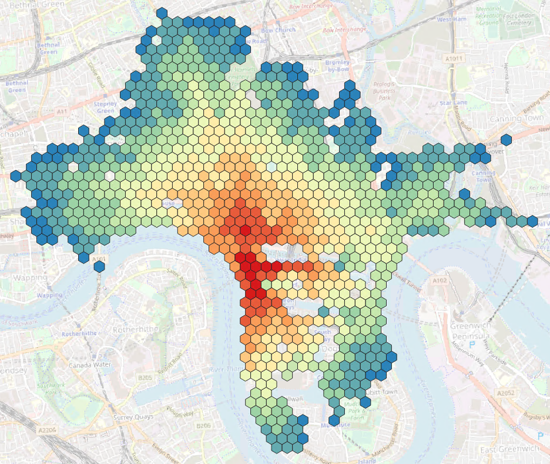
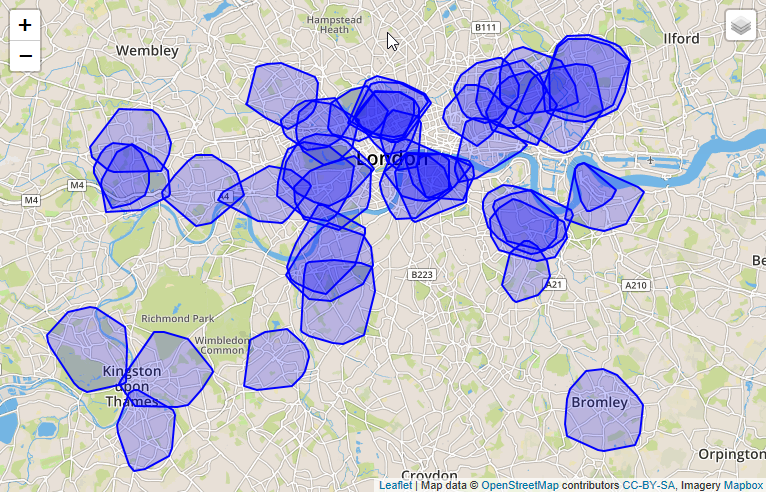
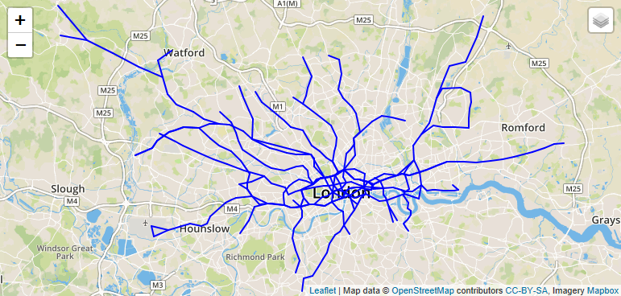

# Exercise 9 - Calculate Isochrones and Closeness Centrality

In this exercise we will explore two more fundamental functions: `Shortest Paths One-To-All` (SPOA) and `Breadth First Search` (BFS). The first one does the obvious - given a start vertex, it calculates the distance/cost to every other vertex in the graph. SPOA can be used to calculate [isochrones](https://wiki.openstreetmap.org/wiki/Isochrone), i.e. areas with the same drive time distance. [BFS](https://en.wikipedia.org/wiki/Breadth-first_search) is a fundamental building block for many graph algorithms, including [Closeness Centrality](https://en.wikipedia.org/wiki/Closeness_centrality) - one of multiple standard centrality algorithms to identify the "importance" of a vertex in a network.<br>

## Exercise 9.1 Using Shortest_Path_One_To_All <a name="subex1"></a>

The Shortest_Path_One_To_All is similar to the Shortest_Path we have seen in the previous exercises. As the name suggests, it calculates the minimum distances/costs from a start vertex to all other vertices in the network. The result is not single a `WeigthedPath`, but a `Graph` which contains edges of shortest paths only. The vertices of the output `Graph` have an attribute "CALCULATED_COST" which indicates the minimum distance/cost required to reach the vertex.

`GRAPH g_spoa = SHORTEST_PATHS_ONE_TO_ALL(:g, :v_start, "CALCULATED_COST", `<br>
`(EDGE e, DOUBLE current_path_cost) => DOUBLE { `<br>
`IF(:current_path_cost < :i_max) { RETURN :e."length"/DOUBLE(:e."SPEED_MPH"); }`<br>
`ELSE { END TRAVERSE; }`<br>
`});`

```SQL
CREATE TYPE "DAT260"."TT_SPOA_VERTICES" AS TABLE ("osmid" BIGINT, "CALCULATED_COST" DOUBLE);

CREATE OR REPLACE PROCEDURE "DAT260"."GS_SPOA"(
	IN i_startVertex BIGINT, 		-- the key of the start vertex
	IN i_max DOUBLE,				-- the maximum distance/cost
	OUT o_vertices "DAT260"."TT_SPOA_VERTICES"
	)
LANGUAGE GRAPH READS SQL DATA AS
BEGIN
	GRAPH g = Graph("DAT260", "LONDON_GRAPH");
	VERTEX v_start = Vertex(:g, :i_startVertex);
	-- Running shortest paths one to all, which returns a subgraph. The WEIGHT based path length to a vertex is stored in the attribute CALCULATED_COST
	GRAPH g_spoa = SHORTEST_PATHS_ONE_TO_ALL(:g, :v_start, "CALCULATED_COST",
		(EDGE e, DOUBLE current_path_cost) => DOUBLE{
  			IF(:current_path_cost < :i_max) { RETURN :e."length"/(DOUBLE(:e."SPEED_MPH")*0.44704); }
            ELSE { END TRAVERSE; }
  		});
	o_vertices = SELECT :v."osmid", :v."CALCULATED_COST" FOREACH v IN Vertices(:g_spoa);
END;

-- Where can we go in 300 seconds starting Canary Wharf
CALL "DAT260"."GS_SPOA" (1433737988, 300, ?);
```

In order to visualize the data, let's wrap it in a function and do some post-processing to our graph results. With resultType = `POINTS` the function will return the raw data, i.e. the individual street intersections that are reachable given a certain maximum of travel time. With resultType = `CONVEXHULL` the function will calculate a convex hull of the points and return a single shape. Finally, with resultType = `HEXAGON` a spatial clustering is applied and travel times are averaged for each cluster cell.

```sql
CREATE OR REPLACE FUNCTION "DAT260"."F_SPOA_VERTICES"(
	IN i_startVertex BIGINT, 		-- the key of the start vertex
	IN i_max DOUBLE,				-- the maximum distance/cost
	IN i_resultType NVARCHAR(20)	-- indicates if the result should be POINTS, CONVEXHULL, or HEXAGON
	)
    RETURNS TABLE("ID" BIGINT, "SHAPE" ST_GEOMETRY(32630), "CALCULATED_COST" DOUBLE)
LANGUAGE SQLSCRIPT READS SQL DATA AS
BEGIN
    CALL "DAT260"."GS_SPOA"(:i_startVertex, :i_max, o_path_vertices);
	IF (:i_resultType = 'POINTS') THEN
		RETURN SELECT pv."osmid" AS "ID", lv."SHAPE", pv."CALCULATED_COST"
		FROM :o_path_vertices AS pv
		LEFT JOIN "DAT260"."LONDON_VERTICES" lv ON pv."osmid" = lv."osmid";
	ELSEIF (:i_resultType = 'CONVEXHULL') THEN
		RETURN SELECT i_startVertex AS "ID", ST_CONVEXHULLAGGR("SHAPE") AS "SHAPE", :i_max AS "CALCULATED_COST" FROM (
		SELECT pv."osmid", lv."SHAPE", pv."CALCULATED_COST"
		FROM :o_path_vertices AS pv
		LEFT JOIN "DAT260"."LONDON_VERTICES" lv ON pv."osmid" = lv."osmid");
	ELSEIF (:i_resultType = 'HEXAGON') THEN
		RETURN SELECT ST_CLUSTERID() AS "ID", ST_CLUSTERCELL() AS "SHAPE", CAST(AVG("CALCULATED_COST") AS DOUBLE) AS "CALCULATED_COST" FROM (
		SELECT pv."osmid", lv."SHAPE", pv."CALCULATED_COST"
		FROM :o_path_vertices AS pv
		LEFT JOIN "DAT260"."LONDON_VERTICES" lv ON pv."osmid" = lv."osmid")
		GROUP CLUSTER BY "SHAPE" USING HEXAGON X CELLS 50;
	END IF;
END;
-- again, exploring from Canary Wharf
SELECT * FROM "DAT260"."F_SPOA_VERTICES"(1433737988, 60, 'POINTS') ORDER BY "CALCULATED_COST" DESC;
SELECT * FROM "DAT260"."F_SPOA_VERTICES"(1433737988, 60, 'CONVEXHULL') ORDER BY "CALCULATED_COST" DESC;
SELECT * FROM "DAT260"."F_SPOA_VERTICES"(1433737988, 240, 'HEXAGON') ORDER BY "CALCULATED_COST" DESC;
```
The HEXAGON result can be color-coded by the average CALCULATED_COST. On a map this looks like below. Areas with the same color can be reached with the same drive time - so called isochrones.



Let's say we want to do business with a the cyclists in London. Our goal is to open a new bike repair shop. To find the right location for our shop, we could look at the existing repair stations and their reach. Maybe we find white spots on the map where there is not a lot of competition.<br>
So let's calculate 3 min drive time areas around all the bike repair shops in London. We'll use the MAP_MERGE operation to digest multiple POIs.

```sql
CREATE OR REPLACE FUNCTION "DAT260"."F_SPOA_VERTICES_MULTI" (IN i_filter NVARCHAR(5000), IN i_max DOUBLE, IN i_resultType NVARCHAR(20))
	RETURNS TABLE("ID" BIGINT, "SHAPE" ST_GEOMETRY(32630), "CALCULATED_COST" DOUBLE)
LANGUAGE SQLSCRIPT READS SQL DATA AS
BEGIN
	startPOIs = APPLY_FILTER("DAT260"."LONDON_POI", :i_filter);
	res = MAP_MERGE(:startPOIs, "DAT260"."F_SPOA_VERTICES"(:startPOIs."VERTEX_OSMID", :i_max, :i_resultType));
	RETURN SELECT * FROM :res;
END;

SELECT * FROM "DAT260"."F_SPOA_VERTICES_MULTI"(' "amenity" = ''bicycle_repair_station'' ', 180, 'CONVEXHULL');
```
The result is a set of CONVEXHULL polygons which indicate "good repair shop coverage".



## Exercise 9.2 Using TRAVERSE BFS to implement Closeness Centrality <a name="subex2"></a>

For the next exercises we will use a different network, the London Tube network. It is a simple dataset in which the tube stations represent vertices, the sequence of stations along a tube line are the edges.




```SQL
SELECT * FROM "DAT260"."LONDON_TUBE_STATIONS";
SELECT * FROM "DAT260"."LONDON_TUBE_CONNECTIONS";

CREATE GRAPH WORKSPACE "DAT260"."TUBE_GRAPH"
	EDGE TABLE "DAT260"."LONDON_TUBE_CONNECTIONS"
		SOURCE COLUMN "SOURCE"
		TARGET COLUMN "TARGET"
		KEY COLUMN "ID"
	VERTEX TABLE "DAT260"."LONDON_TUBE_STATIONS"
		KEY COLUMN "ID";
```

When you traverse a network in a breadth first search manner, you explore the vertices level by level. Starting at a vertex, you first visit all its direct neighbors, then the neighbors of the neighbors and so forth. BFS is a fundamental building block for many custom graph algorithms. In HANA, you can "hook" into the vertex/edge "visit" events, executing any logic.

`TRAVERSE BFS ('ANY') :g FROM :v_start`<br>`
ON VISIT VERTEX (Vertex v_visited, BIGINT lvl) {`<br>
[any logic goes here]<br>
`};`

In the example below, we hook into the VISIT VERTEX event and calculate a count and a cost. These numbers are then used to derive multiple closeness centrality measures.

```SQL
CREATE TYPE "DAT260"."TT_RESULT_CC" AS TABLE (
    "ID" BIGINT, "CLOSENESS_CENTRALITY" DOUBLE, "NORMALIZED_CLOSENESS_CENTRALITY" DOUBLE, "HARMONIC_CENTRALITY" DOUBLE, "NORMALIZED_HARMONIC_CENTRALITY" DOUBLE
);
```
```SQL
CREATE OR REPLACE PROCEDURE "DAT260"."GS_CC_SINGLE_SOURCE"(
	IN i_start BIGINT,
	OUT o_vertices "DAT260"."TT_RESULT_CC"
	)
LANGUAGE GRAPH READS SQL DATA AS
BEGIN
	GRAPH g = Graph("DAT260","TUBE_GRAPH");
  -- we need to add attributes to the vertices to store the data
	ALTER g ADD TEMPORARY VERTEX ATTRIBUTE (DOUBLE "CLOSENESS_CENTRALITY");
	ALTER g ADD TEMPORARY VERTEX ATTRIBUTE (DOUBLE "NORMALIZED_CLOSENESS_CENTRALITY");
	ALTER g ADD TEMPORARY VERTEX ATTRIBUTE (DOUBLE "HARMONIC_CENTRALITY");
	ALTER g ADD TEMPORARY VERTEX ATTRIBUTE (DOUBLE "NORMALIZED_HARMONIC_CENTRALITY");
  -- initialize the start vertex and some variables
	VERTEX v_start = Vertex(:g, :i_start);
	BIGINT v_sumNodes = 0L;
	BIGINT v_sumCost = 0L;
	DOUBLE v_sumReciprocCost = 0.0;
  -- now we are traversing the graph from the start vertex, following the edges in any direction.
  -- when a vertex is visited, the vertex is accessible as "v_visited". The "level" information is stored in "lvl".
  -- within the vertex visit event, we increase the sum of visited nodes and the sum of costs.
	TRAVERSE BFS ('ANY') :g FROM :v_start ON VISIT VERTEX (Vertex v_visited, BIGINT lvl) {
	    IF (:lvl > 0L){
	    	v_sumNodes = :v_sumNodes + 1L;
		    v_sumCost = :v_sumCost + :lvl;
		    v_sumReciprocCost = :v_sumReciprocCost + 1.0/DOUBLE(:lvl);
		}
	};
  -- if the traversal is finished, we derive the final measures
	IF (:v_sumCost > 0L AND :v_sumReciprocCost > 0.0 AND :v_sumNodes > 1L){
		v_start."CLOSENESS_CENTRALITY" = 1.0/DOUBLE(:v_sumCost);
		v_start."NORMALIZED_CLOSENESS_CENTRALITY" = DOUBLE(:v_sumNodes)/DOUBLE(:v_sumCost);
		v_start."HARMONIC_CENTRALITY" = :v_sumReciprocCost;
		v_start."NORMALIZED_HARMONIC_CENTRALITY" = :v_sumReciprocCost/DOUBLE(:v_sumNodes);
	}
	MULTISET<Vertex> m_v = v IN Vertices(:g) WHERE :v."CLOSENESS_CENTRALITY" >= 0.0;
	o_vertices = SELECT :v."ID", :v."CLOSENESS_CENTRALITY", :v."NORMALIZED_CLOSENESS_CENTRALITY", :v."HARMONIC_CENTRALITY", :v."NORMALIZED_HARMONIC_CENTRALITY" FOREACH v IN :m_v;
END;
```
```SQL
CALL "DAT260"."GS_CC_SINGLE_SOURCE"(117, ?);
```

Now the closeness centrality measures for a single vertex in a network is not really meaningful. We need to calculate the centrality for all vertices to find the most important one. We could do this by adding a loop into or GRAPH program. A nice way to implement such loops in a parallel way is by using the MAP_MERGE operator in SQLScript.
For this, we need to wrap the procedure in a function like we did in exercise 8.4.
```SQL
CREATE OR REPLACE FUNCTION "DAT260"."F_CC_SINGLE_SOURCE"(IN i_start BIGINT)
    RETURNS "DAT260"."TT_RESULT_CC"
LANGUAGE SQLSCRIPT READS SQL DATA AS
BEGIN
    CALL "DAT260"."GS_CC_SINGLE_SOURCE"(:i_start, result);
    RETURN :result;
END;
```
Next, we can invoke this function on a set input parameters in a parallel way.
```SQL
CREATE OR REPLACE FUNCTION "DAT260"."F_CC_MAP_MERGE" ()
	RETURNS "DAT260"."TT_RESULT_CC"
LANGUAGE SQLSCRIPT READS SQL DATA AS
BEGIN
	startVertices = SELECT DISTINCT "ID" FROM "DAT260"."LONDON_TUBE_STATIONS";
	result = MAP_MERGE(:startVertices, "DAT260"."F_CC_SINGLE_SOURCE"(:startVertices."ID"));
	RETURN :result;
END;
```
```SQL
SELECT * FROM "DAT260"."F_CC_MAP_MERGE"() ORDER BY "NORMALIZED_CLOSENESS_CENTRALITY" DESC;
```
Again, we can mix the results from a graph function with other SQL operations, like a JOIN.
```SQL
SELECT *
  FROM "DAT260"."F_CC_MAP_MERGE"() AS C
	LEFT JOIN "DAT260"."LONDON_TUBE_STATIONS" AS S
  ON C."ID" = S."ID"
	ORDER BY "NORMALIZED_CLOSENESS_CENTRALITY" DESC;
```
The result shows vertices, i.e. tube stations, where the blue ones are most important/central to the network.


## Summary

You've now seen how to use Shortest_Path_One_To_All and TRAVERSE BFS.

Continue to - [Overview Page](../../README.md)
